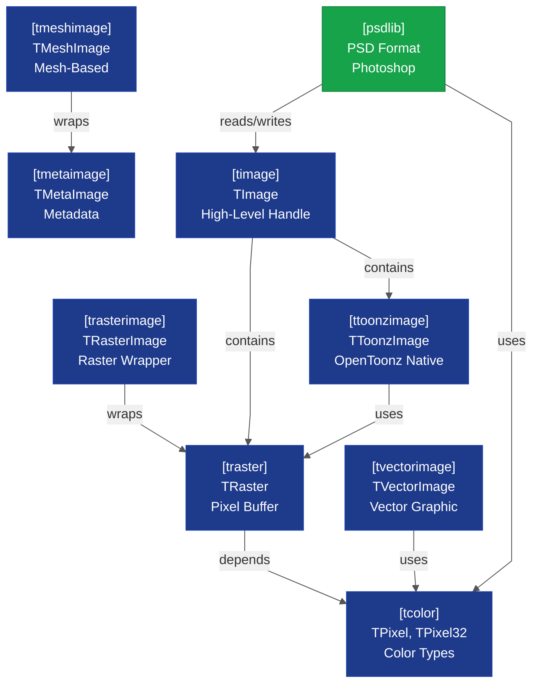
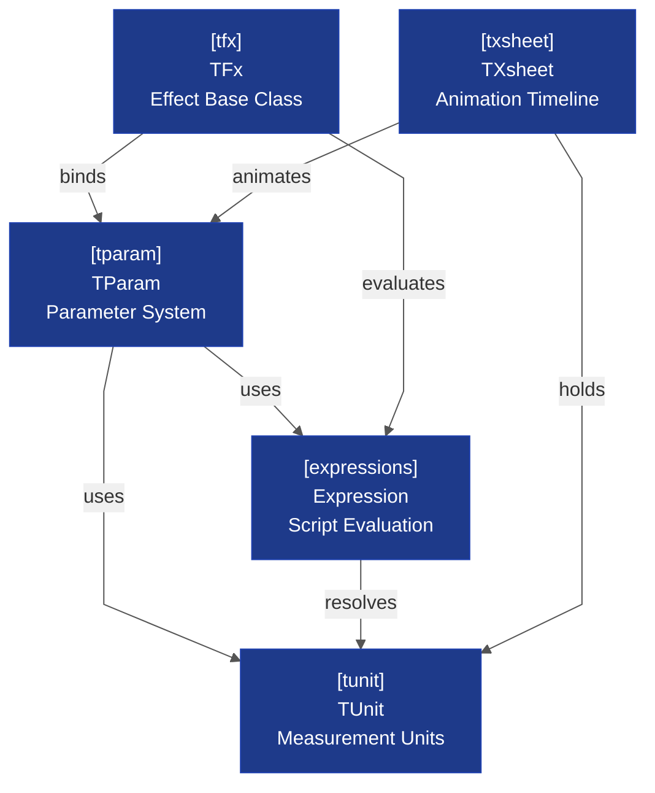
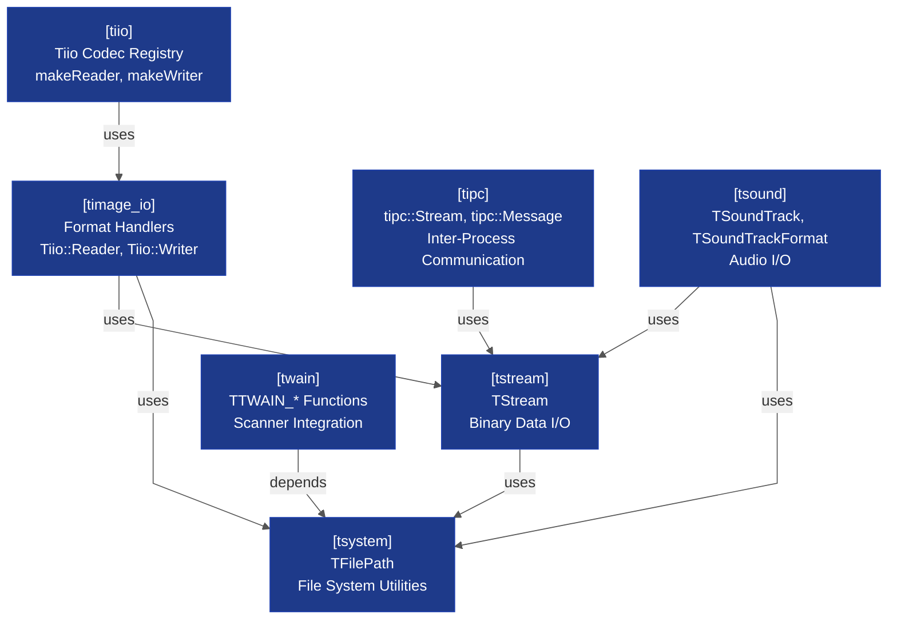
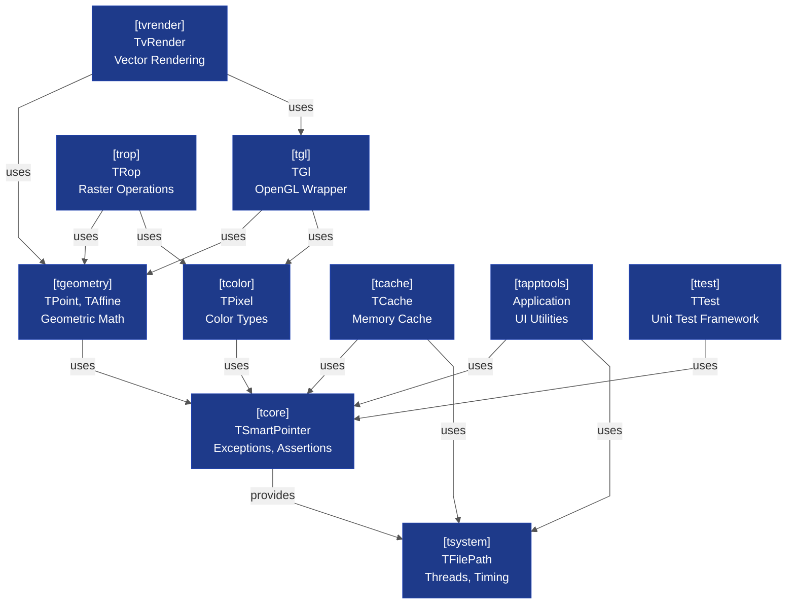

# common/ Library Architecture — Module Map

**Scope:** All 29 subdirectories in `toonz/sources/common/`, split into themed dependency diagrams  
**Complexity:** 4 themed diagrams; each within Small/Medium budget ✓  
**Layer:** Core (tnzcore equivalent) — foundational utilities used by tnzbase, tnzlib, and specialized modules  
**Related Diagrams:** 
- [[opentoonz__core_tnzcore_architecture.md]] – tnzcore type system and rendering
- [[opentoonz__core_tnzbase_tnzext_architecture.md]] – FX framework and parameters

---

## Overview

The `common/` directory contains 30 utility modules organized into four functional themes: (1) **Image and Raster** — data structures for pixels, rasters, images, and mesh images; (2) **FX and Parameters** — effect base classes, parameter binding, and expression evaluation; (3) **I/O and Streams** — file I/O, data streams, IPC, and device integration; (4) **System and Infrastructure** — rendering primitives, caching, color, geometry, and platform utilities.

These modules form the foundation layer below tnzbase/tnzext and are the primary dependency tree for all higher-level subsystems (image, sound, tnzstdfx, toonzlib, etc.).

---

## Theme 1: Image and Raster — Data Structures & Formats

<!-- Complexity: 9 entities, 9 edges (within Small budget ✓) -->

**Scope:** Pixel data, raster buffers, image containers, and format-specific wrappers (vector, mesh, metadata)  
**Key Classes:** TRaster, TPixel, TImage, TVectorImage, TToonzImage, TMetaImage, TMeshImage

### Diagram



### Key Relationships

- **tcolor** (TPixel, TPixel32, TPixel64) provides the per-pixel value type; supports multiple formats (32-bit ARGB, 64-bit, grayscale).
- **traster** (TRaster) is the immutable pixel buffer container; holds raw pixel data in various formats.
- **timage** (TImage) is the high-level handle to a raster; can contain multiple levels/mipmaps and metadata.
- **trasterimage** wraps TRaster for explicit raster image representation; used by codec handlers.
- **ttoonzimage** (TToonzImage) is the OpenToonz-native image type; supports both raster and vector layers.
- **tvectorimage** (TVectorImage) represents vector graphics; composed of strokes and fills.
- **tmeshimage** (TMeshImage) extends image concept to mesh-based deformations; wraps metadata.
- **tmetaimage** (TMetaImage) is a handle that can contain raster, vector, or mesh data with metadata.
- **psdlib** reads/writes Adobe Photoshop `.psd` files; depends on timage and tcolor for format conversion.

### Design Notes

- **Copy-on-Write:** TRaster uses COW semantics to avoid expensive pixel copies; TImage is a handle.
- **Format Abstraction:** TPixel variants (32-bit, 64-bit, grayscale) allow runtime format selection without template explosion.
- **Layering:** tcolor is the foundation; traster builds on it; higher types (TToonzImage, TVectorImage) compose them.
- **PSD Integration:** psdlib is separate to keep core image types independent of Adobe SDK; loaded dynamically by `image` codec library.

---

## Theme 2: FX and Parameters — Effect Framework & Animation

<!-- Complexity: 5 entities, 7 edges (within Small budget ✓) -->

**Scope:** Effect base classes, parameter binding system, expression evaluation, unit handling, and animation timeline  
**Key Classes:** TFx (base effect), TParam (parameter), Expression, TUnit (measurement units), TXsheet (animation timeline)

### Diagram



### Key Relationships

- **tunit** (TUnit) defines measurement units (pixels, degrees, percent, etc.); used for parameter ranges and normalization.
- **tparam** (TParam) is the parametric animation system; stores keyframes, curves, and interpolation; used throughout the application.
- **expressions** (Expression) provides script evaluation; used in parameter expressions for dynamic binding.
- **tfx** (TFx) is the base effect class; holds parameter ports, input/output connections, and evaluation logic.
- **txsheet** (TXsheet) is the animation timeline; holds columns (layers), cells (frames), and animates parameters over time.
- **Parameter-Expression Link:** Effects bind expressions to parameters to create dynamic, scriptable behaviors.
- **Timeline-Parameter Link:** Xsheet columns animate parameters; each cell references a parameter value at a frame.
- **Unit Handling:** Units are embedded in parameters; used for UI scaling and range enforcement.

### Design Notes

- **Macro Effects:** tfx supports macro effects (nested effect graphs) via port composition.
- **Lazy Evaluation:** Expressions are evaluated on-demand; cached results avoid recomputation.
- **Plugin Architecture:** tfx is the extension point for third-party effects; plugins register via tnzbase plugin manager.
- **Keyframe Interpolation:** tparam supports multiple curve types (linear, cubic, hold); used by timeline UI and rendering pipeline.

---

## Theme 3: I/O and Streams — File & Data I/O

<!-- Complexity: 7 entities, 8 edges (within Small budget ✓) -->

**Scope:** File I/O, format handlers, data streams, IPC, sound I/O, and device integration (TWAIN/scanner)  
**Key Classes:** TStream, Tiio::Reader, Tiio::Writer, tipc::Stream, tipc::Message, TSoundTrack, TTWAIN_*

### Diagram



### Key Relationships

- **tsystem** (TFilePath, TFileStatus, etc.) provides file system utilities; abstraction over platform-specific file operations.
- **tstream** (TStream, TIstream, TOstream) is the binary I/O abstraction; supports buffering, compression (LZ4), and byte-order conversion.
- **tiio** (Tiio codec registry) provides factory functions (makeReader, makeWriter) and registration (defineReaderMaker, defineWriterMaker) for image format handlers; dynamically loads codecs (PNG, TIFF, JPEG, FFmpeg, etc.).
- **timage_io** (Tiio::Reader, Tiio::Writer) provides abstract base classes for format-specific read/write implementations; codec classes inherit and implement format-specific logic; uses tstream for serialization.
- **tipc** (tipc::Stream, tipc::Message) handles inter-process communication over local sockets (QLocalSocket); used for 32-bit rendering service and farm coordination.
- **tsound** (TSoundTrack, TSoundTrackFormat) represents audio data and metadata; TSoundTrack holds PCM samples in various formats; used for playback synchronization with video.
- **twain** (TTWAIN_* C-style functions) provides scanner/TWAIN interface (Windows/macOS); loads images from physical scanners via TWAIN SDK.

### Design Notes

- **Format Registry Pattern:** tiio namespace maintains a registry of codec factories (defineReaderMaker, defineWriterMaker); allows plugins to register formats at runtime.
- **Codec Abstraction:** timage_io defines generic Tiio::Reader/Tiio::Writer abstract base classes; codec subclasses inherit and implement format-specific logic.
- **Compression:** tstream supports LZ4 and legacy LZO compression; transparent to caller.
- **IPC Protocol:** tipc uses QLocalSocket for IPC (cross-platform local sockets); Message class encapsulates atomic communications with length-prefixed encoding; supports shared memory buffers for large data transfer.
- **Platform Variants:** twain, tsound have separate implementations per platform (Windows TWAIN SDK, DirectSound; macOS Quartz, Audio Queue; Linux alsa or PulseAudio).

---

## Theme 4: System and Infrastructure — Primitives & Utilities

<!-- Complexity: 10 entities, 14 edges (within Small budget ✓) -->

**Scope:** Core platform utilities, geometric types, rendering primitives, caching, and infrastructure  
**Key Classes:** TAffine (affine transforms), TGeometry (points, rectangles), TGl (OpenGL wrapper), TCache (memory cache)

### Diagram



### Key Relationships

- **tcore** (TSmartPointer, TException, assertion macros) is the foundational library; provides memory management, error handling, and debug utilities.
- **tsystem** (TFilePath, TThread, TMutex, TTimer) provides OS abstraction for file paths, threading, and timing; platform-specific implementations (Windows, macOS, Linux).
- **tgeometry** (TPoint, TRectangle, TAffine, TMatrix) defines 2D/3D geometric types; used throughout rendering and transformation.
- **tcolor** (TPixel, TPixel32, color conversion) defines pixel and color types; foundation for image operations.
- **tgl** (TGl, TGlContext, TGlShader) is the OpenGL wrapper; manages contexts, framebuffers, and shader compilation.
- **trop** (TRop::copy, TRop::blend, etc.) implements raster operations (copy, blend, fill, antialias); GPU and CPU variants.
- **tvrender** (TvRender) renders vector strokes; uses OpenGL for GPU acceleration; includes stroke tessellation and antialiasing.
- **tcache** (TCache, TMemoryPool) provides memory-pooled cache for frame buffers and computed images; LRU eviction.
- **tapptools** (application-level utilities like TRepetitor for UI event coalescing) provides higher-level application support.
- **ttest** (test framework) provides unittest macros and test runners; used by standalone binaries.

### Design Notes

- **Smart Pointers:** tcore defines TSmartPointer (reference-counted) and TDoublePointer (double-buffered); used throughout OpenToonz for memory safety.
- **Platform Abstraction:** tsystem isolates platform-specific code (Win32 API, POSIX, macOS) from generic algorithms.
- **Geometry Foundation:** tgeometry is the base for all spatial operations; affine transformations compose.
- **OpenGL Abstraction:** tgl abstracts over GL versions and driver quirks; manages version compatibility (GL 1.2 fallback, GL 3.0+).
- **Raster Ops Optimization:** trop has both naive CPU loops and GPU shader implementations; dispatcher chooses based on buffer size/format.
- **Vector Rendering Pipeline:** tvrender tessellates strokes to triangle meshes; outputs to OpenGL for rasterization.
- **Cache Invalidation:** tcache invalidates by frame number; frame N+1 is assumed to differ from N; no manual cache busting needed.

---

## Dependency Flow

The four themes form a strict dependency hierarchy:

```
Theme 1 (Image & Raster)
    ↑
    Uses tcolor, tgeometry from Theme 4

Theme 2 (FX & Params)
    ↑
    Uses tunit from Theme 4

Theme 3 (I/O & Streams)
    ↑
    Uses tsystem, tstream from both Themes 4 and utilities

Theme 4 (System & Infrastructure)
    ↑
    Foundation: tcore, tsystem (no internal Toonz dependencies)
```

**Key Insight:** Theme 4 (System & Infrastructure) has no dependencies on other themes; it is the true foundation layer. Themes 1–3 build on Theme 4 in non-circular ways.

---

## Cross-Cutting Concerns

### Error Handling

All modules use **tcore** exceptions and assertions:
- `TException` for recoverable errors (file not found, invalid format)
- `TAssert` macros for internal invariant violations (abort on failure)

### Memory Management

All modules use **tcore** smart pointers:
- `TSmartPointer<T>` (reference-counted) for shared ownership
- `TDoublePointer<T>` (double-buffered) for lock-free updates during rendering

### Timing & Scheduling

Modules that need timing (tcache, tsound synchronization) use **tsystem** timers:
- `TStopWatch` for elapsed-time measurement
- `TTimer` for scheduled callbacks

### Platform Abstraction

Modules with platform-specific code (tsystem, tgl, tvrender, tsound, twain) use:
- Compile-time flags (`BUILD_TARGET_WIN`, `BUILD_TARGET_APPLE`, `BUILD_TARGET_UNIX`)
- Separate source files per platform (e.g., `tsound_nt.cpp`, `tsound_qt.cpp`)
- No platform-specific details leak into public headers

---

## Coverage Summary

All 29 `common/` subdirectories are accounted for:

| Theme | Modules | Count |
|-------|---------|-------|
| **Image & Raster** | timage, traster, trasterimage, ttoonzimage, tvectorimage, tmetaimage, tmeshimage, psdlib | 8 |
| **FX & Params** | tfx, tparam, expressions, tunit, txsheet | 5 |
| **I/O & Streams** | tiio, timage_io, tstream, tipc, tsound, twain | 6 |
| **System & Infrastructure** | tcore, tsystem, tgeometry, tcolor, tgl, trop, tvrender, tcache, tapptools, ttest | 10 |
| **TOTAL** | | 29 |

**Note:** `ttest` (testing framework) is included in Theme 4; it's development-only and not deployed in production.

---

## Key Exports by Theme

### Theme 1 Exports (to tnzbase, image, sound, tnzstdfx)
- `TImage`, `TRaster`, `TVectorImage`, `TToonzImage` — data containers
- `TPixel32`, `TPixel64` — pixel formats
- `TMetaImage`, `TMeshImage` — specialized wrappers

### Theme 2 Exports (to toonzlib, tnzstdfx, tcomposer)
- `TFx`, `TRasterFx`, `TColumnFx` — effect hierarchy
- `TParam`, `TDoubleParam`, `TIntParam` — parameter types
- `Expression` — expression AST and evaluator
- `TXsheet`, `TXsheetColumn`, `TXsheetCell` — animation timeline and columns
- `TUnit` — measurement unit system

### Theme 3 Exports (to image, sound, tcleanup, tcomposer)
- `TStream`, `TIstream`, `TOstream` — I/O abstraction
- `Tiio::Reader`, `Tiio::Writer`, `Tiio` registry functions — codec abstraction and registry
- `tipc::Stream`, `tipc::Message` — IPC protocol
- `TSoundTrack`, `TSoundTrackFormat` — audio data representation
- `TTWAIN_*` C-style functions — scanner/TWAIN interface

### Theme 4 Exports (to all libraries)
- `TSmartPointer`, `TDoublePointer` — memory management
- `TException`, `TAssert` — error handling
- `TFilePath`, `TThread` — file and threading utilities
- `TAffine`, `TPoint`, `TRectangle` — geometry
- `TPixel`, color conversion functions — color types
- `TGl`, `TGlContext`, `TGlShader` — rendering
- `TRop::copy`, `TRop::blend` — raster operations
- `TvRender` — vector rendering
- `TCache` — memory cache

---

## See Also

- [[opentoonz__core_tnzcore_architecture.md]] – tnzcore library (a parallel core library containing image, raster, geometry in monolithic form)
- [[opentoonz__core_tnzbase_tnzext_architecture.md]] – tnzbase (FX framework, parameter system, plugins) and tnzext (deformations, linear algebra)
- [[opentoonz__dependency_map.md]] – Full dependency graph of all major subsystems

---

**Document Version:** 1.0  
**Last Updated:** 2026-08-09  
**Verification:** All 29 subdirectories mapped; 4 themed diagrams; each within Small budget ✓
