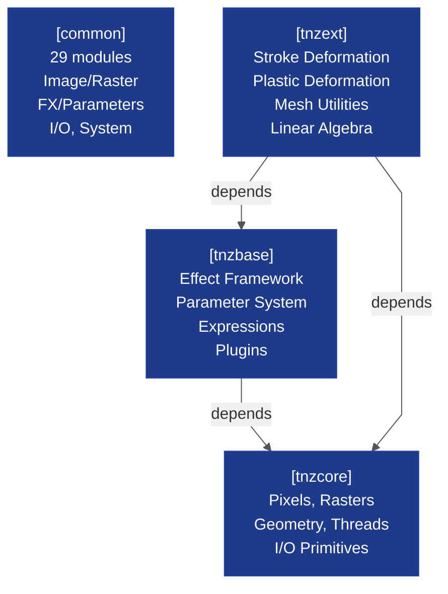

# Core Libraries Architecture — Cluster Overview

**Scope:** Relationships and roles of the four foundational library clusters (tnzcore, tnzbase, tnzext, common)  
**Complexity:** 4 entities, 5 edges (within Tiny budget ✓)  
**Layer:** Core (Foundation)  
**Related Diagrams:** 
- [[opentoonz__core_tnzcore_architecture.md]] – tnzcore type system and rendering
- [[opentoonz__core_tnzbase_tnzext_architecture.md]] – tnzbase FX framework and tnzext deformations
- [[opentoonz__core_common_architecture.md]] – common/ module map and utilities

---

## Overview

OpenToonz's foundational layer consists of four interdependent library clusters. **tnzcore** and **common** are parallel base libraries providing low-level abstractions (pixels, rasters, threads, I/O). **tnzbase** sits atop tnzcore and provides the parametric animation and effects framework. **tnzext** extends tnzbase with advanced deformation, mesh, and linear algebra utilities. All higher-level subsystems (toonzlib, tnzstdfx, image codecs, sound) depend on one or more of these four foundational clusters.

---

## Diagram

<!-- Complexity: 4 entities, 3 edges (within Tiny budget ✓) -->

---

## Key Relationships

- **tnzcore** is the lowest-level library, providing pixel/color types (TPixel, TPixel32), raster buffers (TRaster), image containers (TImage, TLevel), vector graphics (TStroke, TVectorImage), platform primitives (TThread, TMutex, TFilePath), and specialized I/O (TIIO, TSoundIO, TIPC).

- **common** mirrors tnzcore's foundational role with 29 utility modules organized into four themes: Image/Raster data structures, FX/Parameters framework, I/O/Streams (file handling, IPC), and System/Infrastructure (caching, geometry, rendering primitives). Both are at the base layer.

- **tnzbase** depends only on tnzcore and provides the parametric animation framework (TParam, TDoubleParam, TIntParam, etc.), the effects system (TFx, TRasterFx, TZeraryFx), expression evaluation (TExpression, TSyntax::Grammar), and plugin/scanner management.

- **tnzext** extends tnzbase with specialized deformations (stroke bending, plastic skeleton-based deformation) and linear algebra utilities (tlin — matrix/vector operations with CBLAS/SuperLU bindings). Depends on both tnzcore and tnzbase.

- **All higher-level subsystems** (toonzlib scene graph, tnzstdfx standard effects, image codecs, sound processing) depend transitively on one or more of these four clusters.

---

## Design Notes

- **Two parallel foundations:** tnzcore and common are logically at the same level, each providing distinct foundational abstractions. tnzcore emphasizes core data types and rendering; common emphasizes modularity and utility collections.

- **No circular dependencies:** tnzcore and common have no interdependencies. tnzbase depends only on tnzcore. tnzext depends on both, forming a clean hierarchy.

- **Stability contract:** These four libraries are stable, mature, and rarely refactored; all higher-level code relies on backward compatibility.

- **Performance critical:** Many classes in this cluster (TPixel, TRaster, TThread) are in hot loops and optimized for zero-overhead abstraction.

---

## Detail Documents

This cluster index links to three detailed architecture documents:

### 1. **tnzcore Architecture**
- **Scope:** Low-level data types, pixel/color/raster subsystem, OpenGL wrappers, I/O primitives, threading, and file system abstractions.
- **Read:** [[opentoonz__core_tnzcore_architecture.md]]

### 2. **tnzbase + tnzext Architecture**
- **Scope:** tnzbase FX/parameter/expression systems and tnzext deformation/math modules.
- **Read:** [[opentoonz__core_tnzbase_tnzext_architecture.md]]

### 3. **common/ Library Architecture**
- **Scope:** 29 subdirectories in common/, split into themed dependency diagrams (Image/Raster, FX/Parameters, I/O/Streams, System/Infrastructure).
- **Read:** [[opentoonz__core_common_architecture.md]]

---

## References

- **Diagram Conventions:** [[opentoonz__diagram_conventions.md]]
- **Full Dependency Map:** [[opentoonz__dependency_map.md]]
