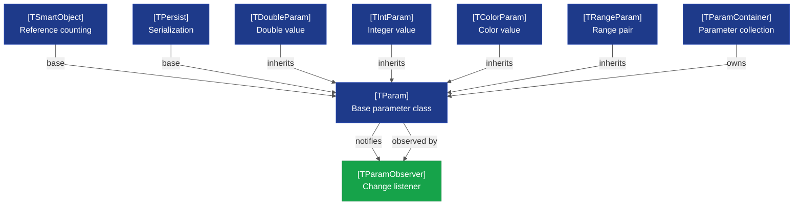
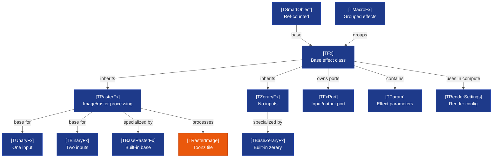
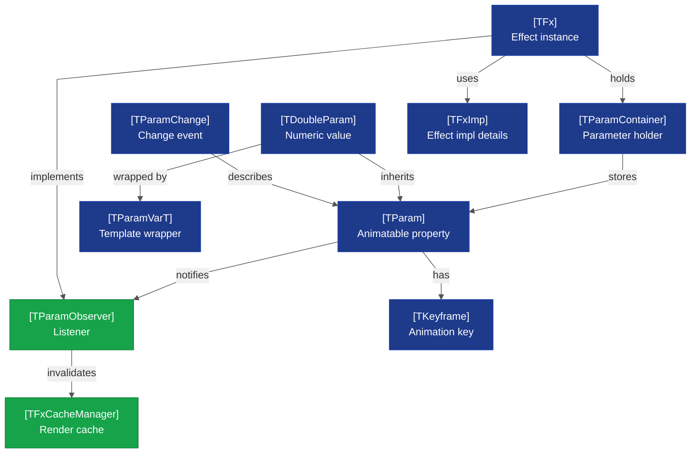
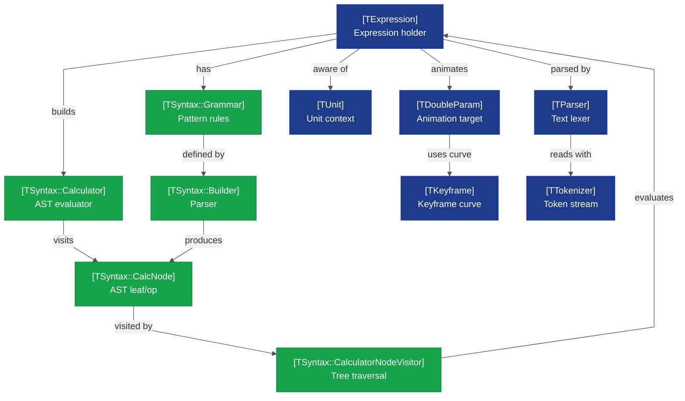
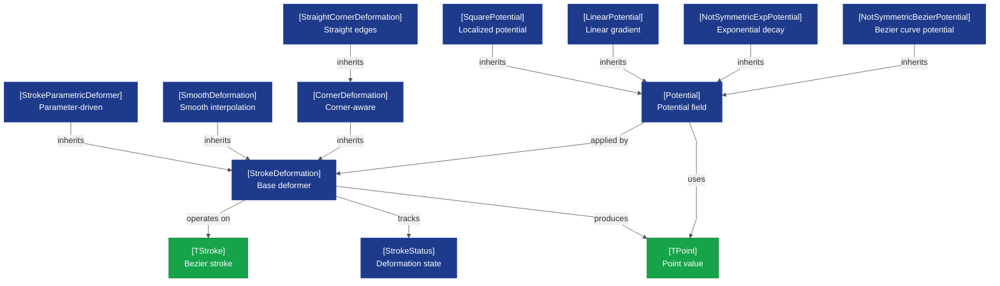
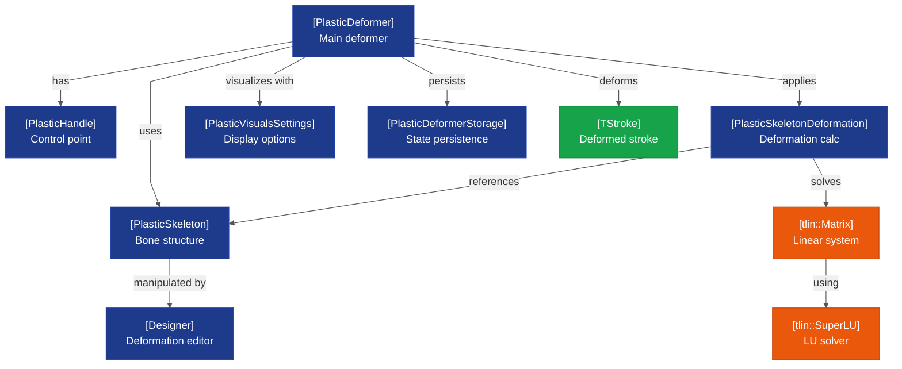
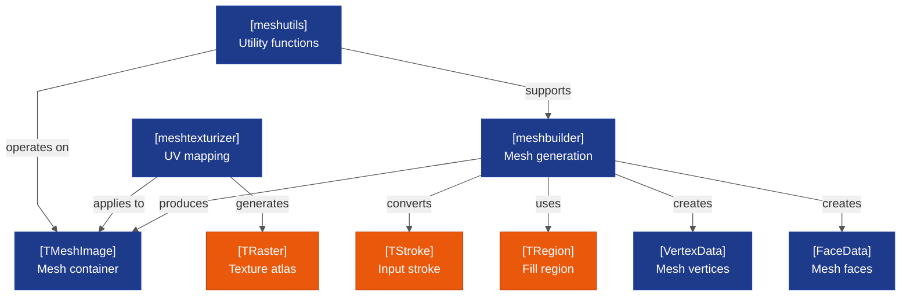
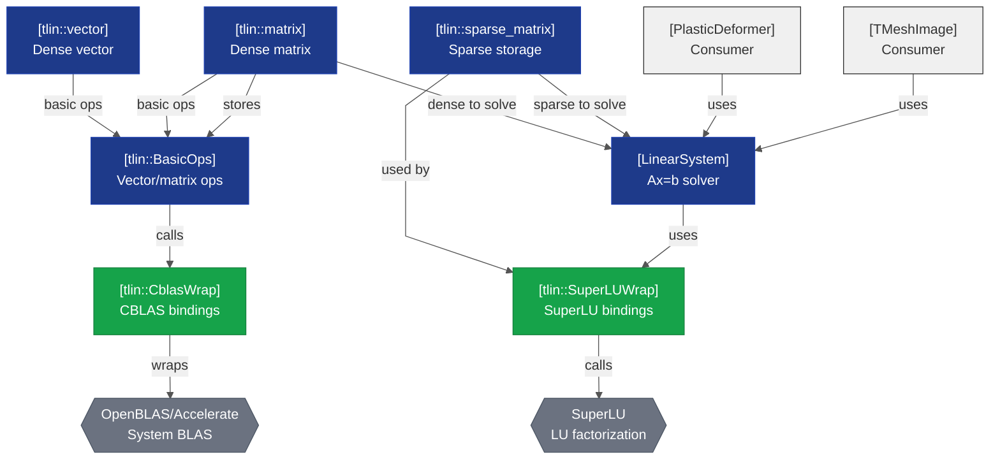
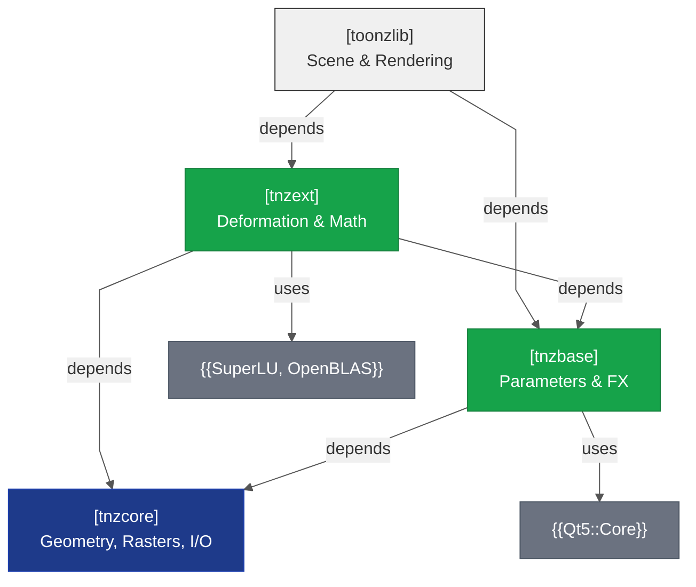

# tnzbase + tnzext Architecture — Abstractions & Extensions

**Scope:** tnzbase FX/parameter/expression systems and tnzext deformation/math modules  
**Complexity:** 9 diagrams across 4,500+ combined LOC (split by concern)  
**Layer:** Core (Foundation abstractions) + Extended (Deformation & math)  
**Related Diagrams:** 
- [[opentoonz__core_libraries_architecture.md]] — Core cluster overview
- [[opentoonz__core_tnzcore_architecture.md]] — tnzcore foundation (types, rasters, geometry)

---

## Overview

**tnzbase** provides the parametric animation and effects framework that all higher-level subsystems depend on:
- **Parameter System** (TParam, TDoubleParam, TIntParam, etc.) — Animatable object properties
- **FX Framework** (TFx, TRasterFx, TZeraryFx) — Effect graph architecture with data ports
- **Expression Evaluator** (TExpression, TSyntax::Grammar) — Math expressions for keyframe interpolation
- **Plugin Management** — Dynamic effect registration and loading
- **Scanner Support** — TWAIN/USB scanner abstraction

**tnzext** extends tnzbase with advanced deformation and linear algebra:
- **Stroke Deformation** — Bézier curves, potentials, smooth deformation
- **Plastic Deformation** — Skeleton-based deformation using SuperLU solvers
- **Mesh Utilities** — Mesh building, texturization, manipulation
- **Linear Algebra** (tlin) — Matrix/vector operations, CBLAS/SuperLU bindings

---

## 1. tnzbase Parameter System Architecture

<!-- Complexity: 9 entities, 9 edges (within Small budget ✓) -->

**Scope:** Core parameter classes (TParam) and specialized parameter types (TDoubleParam, TIntParam, etc.)  
**Complexity:** 9 entities, 10 edges (within Small budget ✓)  
**Layer:** Core  

### Diagram

### Key Relationships

- **TParam** is the abstract base class for all parameters; inherits from TSmartObject (ref-counted) and TPersist (serializable)
- **Parameter Types:** TDoubleParam (floating-point), TIntParam (integer), TColorParam (RGB/RGBA), TRangeParam (min/max pair)
- **Observer Pattern:** TParamObserver instances register with parameters to be notified of value changes (drives UI updates, effect recomputation)
- **TParamContainer** aggregates multiple parameters into a coherent collection (used by effects, objects with configurable properties)

### Design Notes

- Parameters are immutable once created (value change triggers observer notifications)
- No circular dependencies; observers are weakly held to prevent cycles
- Extensible: new parameter types inherit from TParam to gain serialization and notification automatically
- **TODO:** Consider template-based type system for better compile-time parameter validation

---

## 2. tnzbase FX Framework — Effect Class Hierarchy

<!-- Complexity: 13 entities, 12 edges (within Small budget ✓) -->

**Scope:** Effect class hierarchy from TFx base through RasterFx and input-arity specializations  
**Complexity:** 12 entities, 13 edges (within Small budget ✓)  
**Layer:** Core  

### Diagram

### Key Relationships

- **TFx** is the abstract base for all effects; provides port management (input/output connections) and parameter binding
- **Input Arity:** Effects are categorized by input count:
  - **TZeraryFx** — Generators (particle system, gradients, noise)
  - **TUnaryFx** — Single-input effects (blur, sharpen, distortion)
  - **TBinaryFx** — Two-input effects (blend, composite, difference)
- **TRasterFx** — Image/raster processing base; implements `compute(TTile, frame, TRenderSettings)`
- **Built-in Subtypes:** TBaseRasterFx, TBaseZeraryFx for core Toonz effects
- **TMacroFx** — Composite effects; groups child effects into a single node in the DAG
- **Render Pipeline:** TRenderSettings contains affine transform, palette, field info; passed to each effect's `compute()` method

### Design Notes

- **Port Connections:** Effects connect via TFxPort (templated TFxPortT) to form a DAG (directed acyclic graph)
- **Render Caching:** Each effect can report its bounding box via `doGetBBox()`; cache manager optimizes tile computation
- **Platform Independence:** TRasterFx delegates platform-specific rendering (GL, offline rendering) to backends in toonzlib
- **Future:** Consider template specialization for effect input/output types (e.g., vector vs. raster)

---

## 3. tnzbase FX/Parameter Binding

<!-- Complexity: 10 entities, 10 edges (within Small budget ✓) -->

**Scope:** How effects bind parameters, how parameters drive effect recomputation via observer pattern  
**Complexity:** 10 entities, 11 edges (within Small budget ✓)  
**Layer:** Core  

### Diagram

### Key Relationships

- **Parameter Binding:** `bindParam<T>(TFx *fx, name, var)` template creates a TParamVarT<T> wrapper and adds it to the effect's parameter container
- **Change Notifications:** When a parameter changes (via UI slider, keyframe update, expression evaluation), it calls `TParamObserver::onParamChange()`
- **Effect as Observer:** Effects inherit from TParamObserver and respond to parameter changes by invalidating cached render tiles
- **Keyframe Animation:** TDoubleParam stores a sequence of TKeyframe objects with interpolation curves
- **Cache Invalidation:** TFxCacheManager listens to parameter changes and invalidates affected render ranges

### Design Notes

- **Type Safety:** TParamVarT<T> uses templates to type-check parameter binding at compile time
- **Decoupling:** Parameter and observer are decoupled; observers register dynamically and can be removed
- **Performance:** Cache invalidation is conservative (invalidates entire frame range if a keyframe is moved) — opportunity for optimization with frame-range tracking
- **Extensibility:** New parameter types can implement TParam interface to gain observer notifications

---

## 4. tnzbase Expression System — Parametric Animation

<!-- Complexity: 11 entities, 11 edges (within Small budget ✓) -->

**Scope:** Expression grammar, calculator, and parameter animation via string expressions  
**Complexity:** 11 entities, 12 edges (within Small budget ✓)  
**Layer:** Core  

### Diagram

### Key Relationships

- **TExpression** wraps a text expression (e.g., "sin(frame * 0.1) * 100") and evaluates it at runtime
- **Grammar System:** TSyntax::Grammar defines a set of pattern rules (operations, functions, constants)
- **Parsing & Building:** TParser/TTokenizer converts text into tokens; Builder constructs an Abstract Syntax Tree (AST) of CalcNode objects
- **Calculator:** Evaluates the AST via visitor pattern (TSyntax::CalculatorNodeVisitor traverses nodes recursively)
- **Parameter Animation:** TDoubleParam can use an expression instead of/alongside keyframes to compute values
- **Unit Awareness:** Expressions respect unit context (e.g., degrees vs. radians, pixels vs. cm)

### Design Notes

- **Lazy Evaluation:** Expressions are parsed once, then evaluated at each frame request (efficient for animation)
- **Extensibility:** Grammar can be extended with custom operations via plugin system
- **Error Handling:** Invalid expressions are caught during parsing; `TExpression::isValid()` checks syntax
- **Performance:** AST reuse across frames avoids re-parsing; visitor pattern allows for optimization (e.g., constant folding)

---

## 5. tnzext Stroke Deformation System

<!-- Complexity: 13 entities, 14 edges (within Small budget ✓) -->

**Scope:** Stroke deformation classes (potentials, bezier curves, smooth deformers)  
**Complexity:** 13 entities, 14 edges (within Small budget ✓)  
**Layer:** Extended  

### Diagram

### Key Relationships

- **StrokeDeformation Base Class:** Abstract interface for applying transformations to TStroke bezier curves
- **Deformer Specializations:**
  - **StrokeParametricDeformer** — Parameterized deformation (rate, angle, etc.)
  - **SmoothDeformation** — Smooth interpolation without corners
  - **CornerDeformation** — Preserves corner points (hard angles)
  - **StraightCornerDeformation** — Specializes corner deformation for straight edges
- **Potential Fields:** Mathematical models for deformation influence:
  - **SquarePotential** — Localized square region of influence
  - **LinearPotential** — Linear gradient falloff
  - **NotSymmetricExpPotential** — Exponential decay (asymmetric)
  - **NotSymmetricBezierPotential** — Bezier curve as influence function
- **StrokeStatus:** Caches intermediate deformation results (optimization to avoid recomputation)

### Design Notes

- **Composition over Inheritance:** Potential fields can be combined to create complex deformations
- **Performance:** StrokeStatus caches point transformations; reused across frames if stroke/parameters unchanged
- **Precision:** Uses double-precision TPoint for accurate curve transformations
- **Extensibility:** New potential types inherit from Potential and implement `getValue(distance)` method
- **TODO:** Add GPU acceleration for real-time deformation preview

---

## 6. tnzext Plastic Deformation System

<!-- Complexity: 10 entities, 10 edges (within Small budget ✓) -->

**Scope:** Skeleton-based plastic deformation with SuperLU solver integration  
**Complexity:** 10 entities, 11 edges (within Small budget ✓)  
**Layer:** Extended  

### Diagram

### Key Relationships

- **PlasticDeformer** — Main interface; coordinates skeleton manipulation and stroke deformation
- **PlasticSkeleton** — Hierarchical bone structure; defines local and global coordinate systems
- **PlasticHandle** — Control point; user drags handles to deform skeleton
- **Deformation Process:**
  1. User moves handles (changes bone rotations/translations)
  2. PlasticSkeletonDeformation computes influence weights using harmonic functions
  3. Linear system (TMatrix) is solved via SuperLU for smooth deformation field
  4. Stroke points are transformed according to deformation field
- **Visualization:** PlasticVisualsSettings controls display of bones, influence regions, handles
- **Persistence:** PlasticDeformerStorage serializes skeleton structure and parameters
- **Designer:** Interactive editor for skeleton topology and handle placement

### Design Notes

- **Harmonic Interpolation:** Deformation field is computed from bone transformations using Laplace equations (smooth, natural-looking)
- **Linear System:** Sparse matrix formed from mesh/skeleton constraints; SuperLU efficiently solves for deformation weights
- **Performance:** Skeleton/weights precomputed once; handle movement only requires re-solving deformation field (fast)
- **Scalability:** Supports arbitrary skeleton complexity; solver adapts to system size
- **TODO:** Add GPU-based linear solver for real-time interactive deformation

---

## 7. tnzext Mesh System

<!-- Complexity: 9 entities, 8 edges (within Small budget ✓) -->

**Scope:** Mesh building, texturization, and utility classes  
**Complexity:** 8 entities, 9 edges (within Small budget ✓)  
**Layer:** Extended  

### Diagram

### Key Relationships

- **MeshBuilder** — Converts strokes and regions into polygonal mesh (triangulation, vertex generation)
- **VertexData & FaceData** — Mesh topology representation (vertices, triangles, normals)
- **TMeshImage** — High-level mesh container (stores geometry, material properties)
- **MeshTexturizer** — Generates UV coordinates and texture atlases; bakes raster images into mesh textures
- **MeshUtils** — Utility functions for mesh manipulation (smooth, subdivide, weld vertices)
- **Pipeline:** TStroke → MeshBuilder → TMeshImage → MeshTexturizer → TRaster (texture atlas)

### Design Notes

- **Triangulation:** Uses robust algorithm (Delaunay or ear-clipping) to tessellate stroke regions
- **Texture Atlas Packing:** MeshTexturizer packs multiple meshes into single texture for efficient rendering
- **Export:** Meshes can be exported to OBJ/FBX formats for external 3D software
- **Integration:** Mesh data fed into rendering pipeline (tnzlib) for display and effects

---

## 8. tnzext Linear Algebra System (tlin)

<!-- Complexity: 11 entities, 13 edges (within Small budget ✓) -->

**Scope:** Matrix/vector operations, CBLAS wrappers, SuperLU solver integration  
**Complexity:** 11 entities, 13 edges (within Small budget ✓)  
**Layer:** Extended  

### Diagram

### Key Relationships

- **Vector & Matrix** — Dense data structures for linear algebra (rows, columns, element access)
- **BasicOps** — High-level vector/matrix operations (dot product, matrix-vector multiply, transpose)
- **CBLAS Wrapper (CblasWrap)** — Bindings to system BLAS library (OpenBLAS on Linux/Windows, Accelerate on macOS)
  - Offloads heavy computation to optimized BLAS implementations
  - Transparent to client code; BasicOps automatically dispatches to CBLAS when available
- **SparseMatrix** — Compressed sparse row (CSR) format for large, sparse systems (mesh constraints, deformation matrices)
- **LinearSystem** — Solves Ax=b via direct factorization or iterative methods
- **SuperLU Wrapper (SuperLUWrap)** — Bindings to SuperLU sparse direct solver
  - Factors sparse matrices efficiently (LU decomposition)
  - Used by plastic deformation to solve harmonic functions
  - Performance-critical: solver time dominates interactive manipulation

### Key Relationships Continued

- **Consumers:** PlasticDeformer and mesh deformation algorithms depend on LinearSystem for fast solve performance
- **Platform Abstraction:** CBLAS/SuperLU selection determined at build time (macOS uses Accelerate, others use system installations)

### Design Notes

- **Performance Priority:** All linear algebra is performance-critical path; BLAS/SuperLU are hand-tuned for speed
- **Sparse vs. Dense:** SparseMatrix used for mesh/skeleton constraints (typically 95%+ sparse); dense for small systems
- **Memory Management:** Matrices support move semantics to avoid copies during solve iterations
- **Numerical Stability:** SuperLU uses partial pivoting to maintain numerical accuracy
- **Extensibility:** BasicOps can be extended with new operations; CBLAS abstraction allows swapping BLAS implementations
- **TODO:** GPU acceleration via cuBLAS; iterative solvers (GMRES) for very large systems

---

## 9. tnzbase + tnzext Dependency Summary

<!-- Complexity: 6 entities, 7 edges (within Small budget ✓) -->

**Scope:** Top-level module dependencies between tnzbase and tnzext and their external dependencies  
**Complexity:** 6 entities, 7 edges (within Small budget ✓)  
**Layer:** Core + Extended  

### Diagram

### Key Relationships

- **tnzbase** depends only on tnzcore; provides stable abstractions for higher layers
- **tnzext** depends on both tnzcore and tnzbase; extends tnzbase with advanced math
- **toonzlib** consumes both tnzbase and tnzext; builds scene/rendering on top
- **No Circular Dependencies:** Topological order is preserved; safe to link in sequence

---

## References & Implementation Details

### tnzbase Source Locations
- **Parameter System:** `toonz/sources/common/tparam/`
- **FX Framework:** `toonz/sources/common/tfx/tfx.cpp`
- **Expression Evaluator:** `toonz/sources/common/expressions/texpression.cpp`
- **Scanner Support:** `toonz/sources/tnzbase/tscanner/` (Windows TWAIN, macOS USB)
- **Plugin Manager:** `toonz/sources/common/tsystem/tpluginmanager.cpp`

### tnzext Source Locations
- **Stroke Deformation:** `toonz/sources/tnzext/StrokeDeformation.cpp` — StrokeDeformation, Potential variants
- **Plastic Deformation:** `toonz/sources/tnzext/plasticdeformer.cpp`, `toonz/sources/tnzext/plasticskeleton.cpp` — PlasticDeformer, PlasticSkeleton
- **Mesh Utilities:** `toonz/sources/tnzext/meshbuilder.cpp`, `toonz/sources/tnzext/meshtexturizer.cpp`
- **Linear Algebra (tlin):** `toonz/sources/tnzext/tlin/` — Matrix, Vector, CBLAS/SuperLU wrappers

### CMakeLists.txt Configuration
- **tnzbase:** Links Qt5::Core, Qt5::Gui, tnzcore
- **tnzext:** Links Qt5::Core, Qt5::Gui, Qt5::OpenGL, Qt5::Network, tnzcore, tnzbase, **SuperLU, OpenBLAS**

### Test Coverage
- Parameter system: Unit tests in `toonz/sources/tnzbase/test/`
- FX graph: Integration tests in `toonz/test/` (render caching, port connection)
- Expression evaluator: Expression parsing tests
- Plastic deformation: Interactive tests (manual verification in GUI)

---

## Design Patterns & Best Practices

### Pattern: Observer (Parameter Change)
Parameters notify observers (effects, UI) when values change. Decoupled change propagation enables reactive rendering.

### Pattern: Visitor (Expression Calculator)
AST traversal via CalculatorNodeVisitor allows extensibility (add new operations without modifying core evaluator).

### Pattern: Factory (Effect Registration)
TPluginManager registers effect classes dynamically; instantiation via class ID enables script-based effect creation.

### Pattern: Port Graph (Effect DAG)
TFxPort connections form a directed acyclic graph (DAG); cache manager traverses DAG for optimal evaluation order.

### Pattern: Inheritance + Composition (Deformation)
Stroke deformations use inheritance (base class) but compose potential fields (runtime flexibility).

---

## Known Limitations & Future Work

1. **Parameter Expression Scope:** Only TDoubleParam supports expression text; other types (color, geometry) lack expression animation
2. **Deformation Performance:** Real-time plastic deformation requires GPU solver; SuperLU on CPU limits interactive feedback
3. **Mesh Texturing:** Atlas packing not optimal for highly fragmented meshes; consider larger atlases with separate mipmap chains
4. **Sparse Linear Solver:** SuperLU not parallelized; multi-threaded factorization would speed up large systems
5. **Expression Grammar Extensibility:** Plugin-based operation registration not fully implemented; hardcoded operations only

**TODO Diagrams (Future Phases):**
- Effect evaluation order (topological sort, dependency resolution)
- Cache invalidation flow (keyframe update → invalidate → re-render)
- Scanner integration (TWAIN on Windows, USB on macOS/Linux)
- Plugin loading sequence (dynamic library load → effect registration → instantiation)

