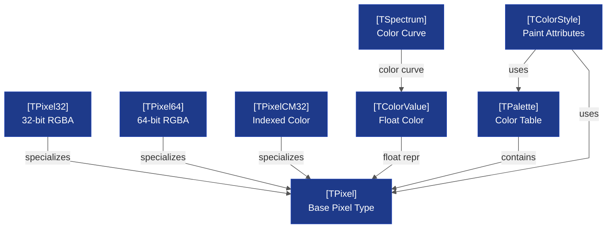
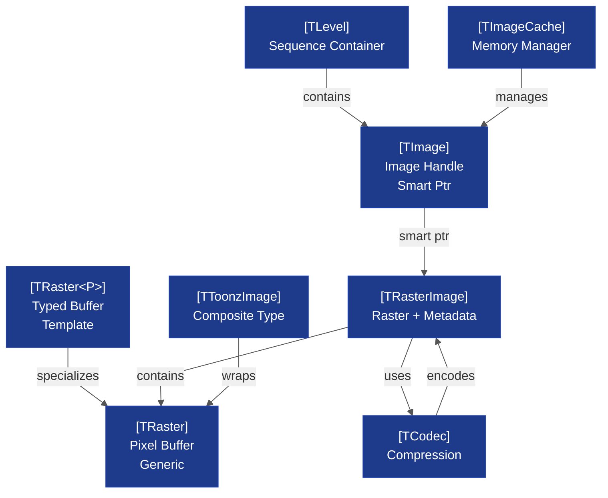
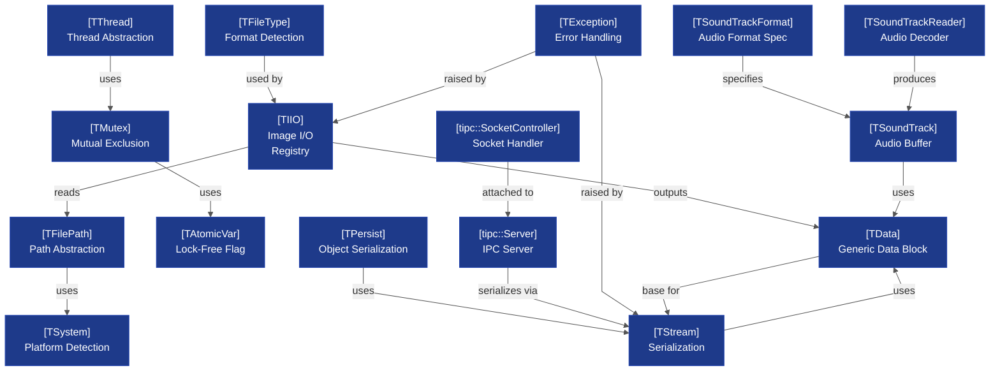

# tnzcore Architecture

**Scope:** Low-level data types, pixel/color/raster subsystem, OpenGL wrappers, I/O primitives, threading, and file system abstractions  
**Complexity:** Split across 3 diagrams (7–14 entities each, within budget ✓)  
**Layer:** Core (Foundation)  
**Related Diagrams:** [[opentoonz__core_tnzbase_tnzext_architecture.md]], [[opentoonz__core_common_architecture.md]]

## Overview

tnzcore is the foundational library providing low-level abstractions for:
- **Pixel/color types** (TPixel, TPixel32, TPixelCM32)
- **Raster buffers** (TRaster, TRasterImage)
- **Image containers** (TImage, TLevel)
- **Vector graphics** (TStroke, TVectorImage, TRegion)
- **Rendering** (OpenGL wrappers, tessellation, offline rendering)
- **System primitives** (threading, IPC, file paths, serialization)
- **Audio I/O** (sound buffers, decoders)

All other libraries depend directly or transitively on tnzcore.

---

## Diagram 1: Pixel & Color Type System

<!-- Complexity: 8 entities, 8 edges (within Small budget ✓) -->



### Key Relationships
- **TPixel variants** support different color depths (32-bit, 64-bit, indexed); immutable and interconvertible
- **TColorValue** provides floating-point color representation for effects and blending
- **TSpectrum** stores per-channel curves for advanced color manipulation
- **TPalette** is a lookup table of TPixel values; commonly used in indexed-color workflows
- **TColorStyle** extends palettes with paint attributes (solid, gradient, pattern)

### Design Notes
- Pixels are **value types** (stack-allocated, no heap overhead)
- Color type selection is determined at compile time, not runtime; templates specialize storage
- Conversion between pixel formats uses explicit functions in `tpixelutils.h`
- No virtual dispatch in the pixel hierarchy; performance-critical hot loop

---

## Diagram 2: Raster & Image Hierarchy

<!-- Complexity: 8 entities, 8 edges (within Small budget ✓) -->



### Key Relationships
- **TRaster** is the low-level pixel buffer; immutable (copy-on-write semantics)
- **TRaster<P>** is a template specialization for a specific pixel type (e.g., TRaster<TPixel32>)
- **TRasterImage** wraps a TRaster with codec metadata and serialization info
- **TImage** is a smart pointer to TRasterImage; used throughout for lazy evaluation and caching
- **TLevel** is a sequence (vector) of TImages; represents an animation level or layer sequence
- **TToonzImage** is a composite type used in toonzlib scene graph (combines raster, vector, sound)
- **TCodec** handles compression/decompression for disk storage
- **TImageCache** manages memory budgets across all loaded images; evicts LRU frames

### Design Notes
- **Immutability:** TRaster uses copy-on-write; modifications trigger a deep copy
- **Lazy evaluation:** TImage delays actual pixel buffer creation until accessed
- **Caching:** TImageCache works in concert with toonzlib's rendering pipeline
- **Persistence:** TRasterImage serialization stores codec, lossless/lossy flags, and pixel data

---

## Diagram 3: Platform Primitives & I/O

<!-- Complexity: 16 entities, 16 edges (within Medium budget ✓) -->



### Key Relationships
- **TThread** is a cross-platform thread wrapper; uses TMutex for synchronization
- **TMutex** and **TAtomicVar** provide low-level concurrency primitives
- **TFilePath** is a platform-agnostic path class (normalizes separators, handles UNC on Windows)
- **TFileType** detects file formats by extension; pluggable codec registry in TIIO
- **TIIO** is a module registry for image codecs; plugins register format handlers via TFileType
- **TStream** provides binary serialization (write/read primitives); exception-safe
- **TPersist** is a marker interface for objects that implement serialize/deserialize
- **TData** is a generic byte blob; used by TStream for polymorphic storage
- **TSoundTrack** holds audio sample data with per-sample access methods; immutable buffers
- **TSoundTrackFormat** specifies audio format properties (sample rate, bit depth, channels, encoding)
- **TSoundTrackReader** decodes audio files (WAV/AIFF/FFmpeg); subclass registry by file extension
- **tipc::Server** is the TCP/IPC server for inter-process effect commands; uses TStream for message protocol
- **tipc::SocketController** manages individual socket connections and dispatches messages to Server
- **TException** is the base for all tnzcore errors (TStreamException, TIOException, etc.)

### Design Notes
- **Concurrency:** No global locks; each subsystem manages its own mutex
- **Platform abstraction:** Separate .cpp files for Windows (tsound_nt.cpp) vs. Qt (tsound_qt.cpp)
- **Audio I/O:** TSoundTrackReader/TSoundTrackWriter use pluggable codec registry (similar to TIIO for images)
- **IPC protocol:** tipc::Server uses QLocalServer/QLocalSocket for cross-process effect rendering; messages serialized via TStream
- **File registry:** TIIO::open() walks codec registry to find handler by file type; TSoundTrackReader/Writer use file extension dispatch
- **Exception safety:** TStream uses RAII for resource cleanup; nested scopes commit/rollback
- **Socket handling:** tipc::SocketController is a private implementation detail (from tipcsrvP.h); Server is the public API

---

## Code References

### Key Header Files
- **Pixel & Color:** `include/tpixel.h`, `include/tcolorvalue.h`, `include/tcolorstyles.h`
- **Raster & Image:** `include/traster.h`, `include/trasterimage.h`, `include/timage.h`, `include/tlevel.h`
- **Threading:** `include/tthread.h`, `common/tcore/tthreadp.h`
- **File I/O:** `include/tfilepath.h`, `include/tiio.h`, `include/tiio_std.h`
- **Serialization:** `include/tstream.h`, `include/tpersist.h`
- **IPC:** `include/tipcsrv.h` (Server), `include/tipcsrvP.h` (SocketController)
- **Audio:** `include/tsound.h` (TSoundTrack, TSoundTrackFormat), `include/tsound_io.h` (TSoundTrackReader, TSoundTrackWriter)
- **System:** `include/tsystem.h`, `common/tsystem/tsystempd.cpp` (platform details)

### CMakeLists.txt Entry Point
- `toonz/sources/tnzcore/CMakeLists.txt` – Defines tnzcore shared library, combines exports from multiple modules

### Source Directories (in common/)
```
common/tcore/          → TData, TException, TThread, TUndo, etc.
common/tcolor/         → TPixel, TColorValue, TSpectrum
common/tgeometry/      → TCurves, geometry types
common/traster/        → TRaster, buffer management
common/timage/         → TImage, TLevel, content history
common/tsystem/        → TFilePath, TFileType, TSystem, TLoggerManager
common/tiio/           → TIIO registry, format detection, BMP/JPEG codec stubs
common/tiio/bmp/       → BMP codec (C code)
common/tiio/jpg/       → JPEG I/O
common/trasterimage/   → TRasterImage, TCodec, TMetaImage
common/timage_io/      → Level serialization
common/tstream/        → TStream, TPersist
common/tipc/           → IPC server, message protocol
common/tvectorimage/   → TStroke, TVectorImage, TRegion
common/tvrender/       → Rendering: palette, tessellation, offline GL
common/tgl/            → OpenGL wrappers, display lists
common/tsound/         → Audio I/O (platform-specific variants)
common/trop/           → Raster operations (blur, convert, etc.)
```

---

## Design Notes

### Why These Subsystems?
1. **Pixel/Color** is the atom; everything else builds on it
2. **Raster/Image** is the main data container; immutable (copy-on-write) for thread safety
3. **Platform Primitives** abstract OS differences (threading, file paths, IPC) so the rest of the codebase is portable

### Architectural Constraints
- **No virtual functions in hot loops:** Pixel type dispatch is template-based, not polymorphic
- **Immutability by default:** Rasters use copy-on-write; effects never modify inputs
- **Cross-platform abstraction:** Separate implementations for Windows/macOS/Linux (tsound_nt.cpp, tsound_qt.cpp)
- **Minimal dependencies:** tnzcore depends only on Qt5::Core, Qt5::OpenGL, system libraries; no higher-level Toonz code

### Performance Characteristics
- **TRaster allocation:** Lazy copy-on-write; shallow copy is O(1), deep copy is O(pixels)
- **TImage smart pointer:** Reference counting avoids redundant codec work
- **TIIO codec lookup:** O(1) hash table; codec selection before file I/O begins
- **TThread:** OS-native threads on Windows/macOS/Linux; no thread pool overhead at this layer

### Future Improvements
- **GPU texture cache:** TRasterImage could memoize OpenGL texture handles
- **Streaming codecs:** TIIO registry could support streaming (partial reads) for video formats
- **Async I/O:** TStream could have async variants for network operations
- **SIMD optimization:** TRop (raster operations) uses NEON/SSE when available

---

## See Also
- [[opentoonz__dependency_map.md]] – Full dependency tree
- [[opentoonz__diagram_conventions.md]] – Diagram budget and syntax rules
- [[opentoonz__core_tnzbase_tnzext_architecture.md]] – Next layer (FX framework, deformations)
