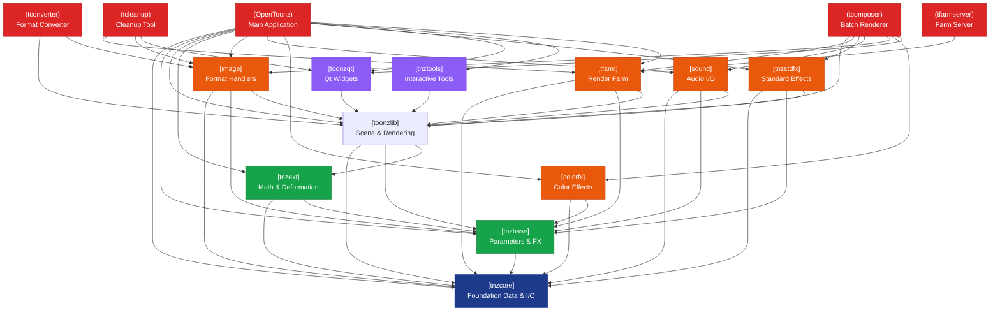
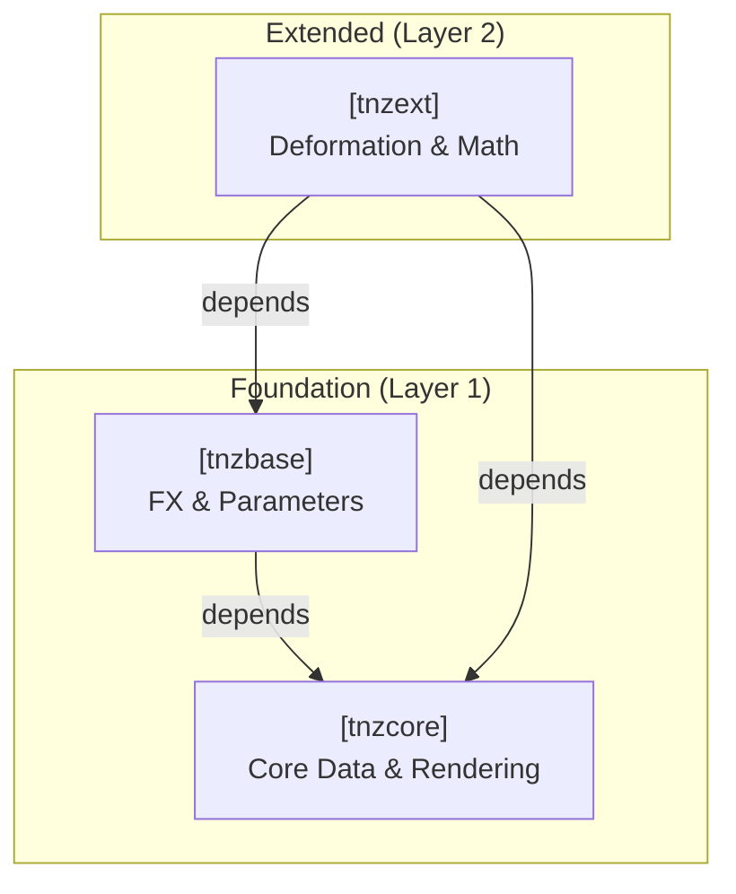

# OpenToonz Dependency Map

**Last Updated:** 2026-08-09  
**Scope:** toonz/sources directory (build targets only)  
**Build System:** CMake 3.10+

---

## 1. Subsystem Overview

The OpenToonz codebase is organized into multiple interconnected subsystems, arranged into logical dependency layers:

### Layer 1: Core Foundation
- **tnzcore** – Low-level data structures, threading, file I/O, raster operations, vector graphics
- **tnzbase** – Parameter system, FX framework, plugin management, scanner support

### Layer 2: Extended Libraries
- **tnzext** – Advanced deformation, mesh utilities, linear algebra (SuperLU/OpenBLAS)
- **toonzlib** – Scene management, stage objects, xsheet handling, rendering, vectorization, scripting

### Layer 3: Specialized Modules
- **image** – Image file format handlers (PNG, TIFF, JPEG, PSD, SVG, FFmpeg, etc.)
- **sound** – Audio I/O (WAV, AIFF, FFmpeg)
- **colorfx** – Color-based effect styles and utilities
- **tnzstdfx** – Standard raster and vector effects (motion blur, particles, etc.)
- **toonzqt** – Qt-based UI components and widgets
- **tnztools** – Interactive drawing/selection/transformation tools
- **tfarm** – Distributed rendering farm server logic

### Layer 4: Executables & Platform-Specific
- **OpenToonz** – Main application (Windows/macOS/Linux)
- **tfarmserver, tfarmcontroller** – Farm management tools
- **tcleanup, tcomposer, tconverter** – Utility applications
- **t32bitsrv** – 32-bit component server (Windows 32-bit only)
- **mousedragfilter** – macOS mouse event filtering library

---

## 2. Detailed Target List

### 2.1 Shared Libraries

| Target | Type | Dependencies (Direct) | Note |
|--------|------|----------------------|------|
| **tnzcore** | SHARED | Qt5::Core, Qt5::OpenGL, Qt5::Network, Qt5::Multimedia; system libs (OpenGL, GLUT, Z, JPEG, LZ4) | Foundation: strings, threads, colors, geometry, rasters, vector images, GL rendering, sound, I/O |
| **tnzbase** | SHARED | Qt5::Core, Qt5::Gui, tnzcore | Parameter system, FX framework, scanner/TWAIN, plugin management, parametric animation |
| **tnzext** | SHARED | Qt5::Core, Qt5::Gui, Qt5::OpenGL, Qt5::Network, tnzcore, tnzbase; SuperLU, OpenBLAS (or Accelerate on macOS) | Stroke deformations, mesh building, plastic deformation, linear algebra solvers |
| **toonzlib** | SHARED | Qt5::Core, Qt5::Gui, Qt5::OpenGL, Qt5::Script, Qt5::Multimedia, tnzcore, tnzbase, tnzext; system libs | Scene/project/xsheet management, stage objects, rendering, vectorization, scripting engine, preferences |
| **image** | SHARED | Qt5::Core, Qt5::Gui, Qt5::Network, tnzcore, tnzbase, toonzlib; TIFF, JPEG, PNG, Z, GLUT, GL | File format handlers: PLI, TGA, PNG, JPEG, TIFF, PSD, SVG, TZL, TZP, Quantel, EXR, Sprite, Mesh, FFmpeg (GIF, WebM, APNG, MP4, MOV, 3GP) |
| **sound** | SHARED | Qt5::Core, tnzcore, tnzbase, toonzlib | Audio format handlers: WAV, AIFF, Raw, FFmpeg |
| **colorfx** | SHARED | Qt5::Core, Qt5::Gui, tnzcore, tnzbase; GL | Raster/region/stroke color styles, zigzag, flow-line effects |
| **tnzstdfx** | SHARED | Qt5::Core, Qt5::Gui, Qt5::OpenGL, tnzcore, tnzbase, toonzlib, image; GL, GLEW; optional OpenCV | Standard effects: gradients, motion blur, particles, perlin noise, warp, radial blur, shader effects, spectra, bokeh, etc. (igs/iwa family) |
| **toonzqt** | SHARED | Qt5::Core, Qt5::Gui, Qt5::Widgets, Qt5::Network, Qt5::OpenGL, Qt5::Svg; GL | Qt UI framework: dock windows, dialogs, viewers, schematic, function panel, flipbook, file browser, preferences, etc. |
| **tnztools** | SHARED | Qt5::Core, Qt5::Gui, Qt5::Widgets, Qt5::Network, Qt5::OpenGL, toonzlib; MYPAINT; GL | Interactive tools: brush, fill, selection, vector/raster, color picker, ruler, etc. |
| **tfarm** | SHARED | Qt5::Core, tnzcore, tnzbase, toonzlib; ws2_32 (Windows) or libusbp | Farm server: task scheduling, rendering coordination, IPC/TCP |
| **toonzpreview** | SHARED | Qt5::Core, image, toonzqt, tnzcore | Windows shell thumbnail preview (Windows only) |

### 2.2 Executables

| Target | Type | Dependencies (Direct) | Note |
|--------|------|----------------------|------|
| **OpenToonz** | EXE | Windows: Qt5 full suite, tnzcore, tnzbase, toonzlib, colorfx, tnzext, image, sound, toonzqt, tnztools, tnzstdfx, tfarm, strmiids; macOS: Qt5 full suite, tnzcore, tnzbase, toonzlib, colorfx, tnzext, image, sound, toonzqt, tnztools, tnzstdfx, tfarm, mousedragfilter; Linux: similar to macOS | Main GUI application. Full feature set. |
| **tfarmserver** | EXE | Qt5::Core, tfarm | Farm server process |
| **tfarmcontroller** | EXE | Qt5::Core, tfarm | Farm controller / monitor |
| **tcleanup** | EXE | Qt5::Core, Qt5::Widgets, tfarm, image | Cleanup utility: converts scanned images to toonz levels |
| **tcomposer** | EXE | Qt5::Core, Qt5::Gui, Qt5::Widgets, toonzlib, tfarm, tnzstdfx, sound, image, colorfx, toonzqt | Batch rendering/compositing tool |
| **tconverter** | EXE | Qt5::Core, toonzlib, image | File format converter |
| **t32bitsrv** | EXE | Qt5::Core, Qt5::Network, tnzcore, image | 32-bit rendering server (Windows 32-bit only) |

### 2.3 Platform-Specific Libraries

| Target | Platform | Dependencies | Note |
|--------|----------|--------------|------|
| **mousedragfilter** | macOS | Cocoa, CoreGraphics, IOKit | Objective-C++ event interception for mouse drag behavior |

---

## 3. Dependency Graph (Topological Order) — Verified from CMake

### Foundation Layer (No internal Toonz dependencies)
```
tnzcore
  ├─ Qt5::Core, Qt5::OpenGL, Qt5::Network, Qt5::Multimedia
  └─ System: GL, GLUT, Z, JPEG, LZ4, AudioUnit, AudioToolbox, Carbon (macOS), etc.
```

### Base Layer (Depends on Foundation)
```
tnzbase
  ├─ tnzcore
  ├─ Qt5::Core, Qt5::Gui
  └─ System: USB (libusb on macOS/Linux), TWAIN (Windows/macOS), IOKit, Cocoa (macOS), etc.

tnzext
  ├─ tnzcore
  ├─ tnzbase
  ├─ Qt5::Core, Qt5::Gui, Qt5::OpenGL, Qt5::Network
  └─ System: SuperLU, OpenBLAS (or Accelerate on macOS), GLUT, GL, etc.
```

### Core Library Layer (Depends on Foundation + Base)
```
toonzlib
  ├─ tnzcore
  ├─ tnzbase
  ├─ tnzext
  ├─ Qt5::Core, Qt5::Gui, Qt5::OpenGL, Qt5::Script, Qt5::Multimedia
  └─ System: GLUT, GL, GLEW, MYPAINT, vfw32 (Windows), etc.
```

### Specialized Module Layer (Depends on Foundation + Base + Core)
```
image
  ├─ tnzcore
  ├─ tnzbase
  ├─ toonzlib
  ├─ Qt5::Core, Qt5::Gui, Qt5::Network
  └─ System: Z, GLUT, GL, JPEG, TIFF, PNG, FFmpeg (libavformat, libavcodec, etc.)

sound
  ├─ tnzcore
  ├─ tnzbase
  ├─ toonzlib
  └─ Qt5::Core

colorfx
  ├─ tnzcore
  ├─ tnzbase
  ├─ Qt5::Core, Qt5::Gui
  └─ System: GL

tnzstdfx
  ├─ tnzcore
  ├─ tnzbase
  ├─ toonzlib
  ├─ Qt5::Core, Qt5::Gui, Qt5::OpenGL
  ├─ System: GL, GLEW, OpenCV (optional, 64-bit only), pthread
  └─ Bundled: kiss_fft
```

### GUI & Tool Layer (Depends on toonzlib)
```
toonzqt
  ├─ toonzlib
  ├─ Qt5::Core, Qt5::Gui, Qt5::Widgets, Qt5::Network, Qt5::OpenGL, Qt5::Svg
  └─ System: GL

tnztools
  ├─ toonzlib
  ├─ Qt5::Core, Qt5::Gui, Qt5::Widgets, Qt5::Network, Qt5::OpenGL
  └─ System: GL, MYPAINT
```

### Farm & Server Layer (Depends on toonzlib)
```
tfarm
  ├─ tnzcore
  ├─ tnzbase
  ├─ toonzlib
  ├─ Qt5::Core, Qt5::Gui, Qt5::OpenGL, Qt5::Network
  └─ System: GL, GLUT, ws2_32 (Windows) or libusb-p (libusbp on macOS/Linux)
```

### Platform-Specific Libraries
```
mousedragfilter (macOS only)
  └─ Cocoa, CoreGraphics, IOKit (Objective-C++)

toonzpreview (Windows only)
  ├─ tnzcore
  ├─ image
  ├─ toonzqt
  └─ System: Windows Shell APIs
```

### Executable Layer (All depend on toonzlib and supporting libraries)
```
OpenToonz
  ├─ tnzcore, tnzbase, toonzlib, colorfx, tnzext
  ├─ image, sound, toonzqt, tnztools, tnzstdfx, tfarm
  ├─ Qt5 (full suite): Core, Gui, Widgets, Network, OpenGL, Svg, Xml, Script, PrintSupport, Multimedia, UiTools
  ├─ System: GL, GLUT, OpenCV (64-bit), MYPAINT
  └─ Platform: mousedragfilter (macOS), strmiids (Windows), SerialPort (64-bit), Canon SDK (optional, 64-bit)

tfarmserver
  ├─ tfarm
  └─ Qt5::Core

tfarmcontroller
  ├─ tfarm
  └─ Qt5::Core

tcleanup (tcleanupper)
  ├─ tfarm
  ├─ image
  ├─ Qt5::Core, Qt5::Widgets
  └─ toonzqt

tcomposer
  ├─ toonzlib, tfarm, tnzstdfx, sound, image, colorfx, toonzqt
  └─ Qt5 (Core, Gui, Widgets)

tconverter
  ├─ toonzlib
  ├─ image
  └─ Qt5::Core

t32bitsrv (Windows 32-bit only)
  ├─ tnzcore
  ├─ image
  └─ Qt5::Core, Qt5::Network
```

### Visual Dependency Graph


---

## 4. Cross-Cutting External Dependencies

### Qt5 Modules (All targets use one or more)
- **Qt5::Core** – Event loop, threading, file I/O, serialization
- **Qt5::Gui** – Painting, color, events, OpenGL integration
- **Qt5::Widgets** – UI framework (buttons, dialogs, layouts, etc.)
- **Qt5::OpenGL** – OpenGL context and rendering
- **Qt5::Network** – TCP/IP, sockets (IPC, farm communication)
- **Qt5::Multimedia** – Audio playback
- **Qt5::MultimediaWidgets** – Video output (macOS)
- **Qt5::Script** – JavaScript scripting engine (toonzlib, image)
- **Qt5::Svg** – SVG rendering (OpenToonz GUI)
- **Qt5::Xml** – XML parsing (OpenToonz)
- **Qt5::PrintSupport** – Print dialogs (OpenToonz)
- **Qt5::UiTools** – Dynamic UI loading (OpenToonz, tcomposer)
- **Qt5::LinguistTools** – Translation (build-time only)

### System Graphics Libraries
- **OpenGL (GL, GLU, GLUT)** – 3D rendering, GLSL shaders
- **GLEW** – OpenGL extensions loader (tnzstdfx, toonzlib, tnztools)

### Image & Video Codecs (tnzcore, image, sound, stdfx)
- **JPEG (libjpeg-turbo)** – JPEG encoding/decoding
- **PNG (libpng)** – PNG encoding/decoding
- **TIFF (libtiff)** – TIFF encoding/decoding
- **Z (zlib)** – Compression (used by PNG, TIFF)
- **FFmpeg (libavformat, libavcodec, libavutil, libswscale)** – GIF, WebM, APNG, MP4, MOV, 3GP encoding/decoding

### Numerical & Math Libraries
- **SuperLU** – LU factorization solver (tnzext)
- **OpenBLAS** or **Accelerate (macOS)** – Linear algebra (tnzext)
- **Boost** – Utilities library (header-only or shared)

### Other Libraries
- **libmypaint** – MyPaint brush engine (tnzcore, tnztools)
- **LZ4** – Fast compression (tnzcore)
- **LZO** – Legacy compression (thirdparty/lzo driver)
- **libusb-1.0** – USB scanner support (tnzbase) [macOS, Linux]
- **TWAIN SDK** – Scanner support Windows
- **Freetype2** – Font rendering [Linux/Unix]
- **OpenCV** – Computer vision (optional, tnzstdfx)

---

## 5. Include Hierarchy

All public headers are under `toonz/sources/include/`:
- `tcore/` – tnzcore APIs
- `tparam/` – Parameter system (tnzbase)
- `tfx/` – FX framework (tnzbase)
- `ext/` – Extension utilities (tnzext)
- `tlin/` – Linear algebra (tnzext)
- `toonz/` – Main library (toonzlib)
- `toonzqt/` – Qt widgets (toonzqt)
- `tools/` – Tool framework (tnztools)
- `stdfx/` – Standard effects (tnzstdfx)
- `colorfx.h` – Color effects (colorfx)
- `tnzsound.h` – Sound I/O (sound)

---

## 6. Subsystem Boundaries & Responsibilities

### tnzcore
- **Core data structures:** pixels, colors, rasters, vector images, levels
- **Rendering:** OpenGL wrapper, offline GL, tessellation
- **Image I/O:** JPEG, PNG, TIFF support; raster/vector serialization
- **Threading:** mutexes, thread management, message queues
- **Sound I/O:** WAV/AIFF/raw decoding, sound buffers
- **IPC:** TCP/IP server/client for 32-bit rendering service

### tnzbase
- **Parametric animation:** keyframe interpolation, curves, expressions
- **FX system:** effect base classes, parameter binding, macro effects
- **Plugin management:** dynamic library loading, effect registration
- **Scanner support:** TWAIN/USB scanner interface

### tnzext
- **Stroke deformations:** bézier curves, potentials, deformation solvers
- **Mesh building:** from strokes, texturing
- **Plastic deformation:** skeleton-based deformation using SuperLU

### toonzlib
- **Project/Scene management:** file format, serialization
- **Xsheet:** timeline, level columns, cell management
- **Stage:** 3D scene graph, cameras, transformations
- **Rendering pipeline:** effects evaluation, output rendering
- **Vectorization:** centerline/outline rasterization
- **Scripting:** JavaScript engine bindings to C++
- **Preferences:** settings storage and retrieval

### image
- **Format handlers:** 15+ file format codecs (PLI, TGA, PNG, etc.)
- **Format detection:** MIME type inference
- **Caching:** memory-managed level/image cache

### sound
- **Audio format handlers:** WAV, AIFF, raw, FFmpeg
- **Playback:** synchronization with rendering

### colorfx
- **Color styles:** paint attributes for raster/vector strokes
- **Effects:** zigzag, flow-line patterns

### tnzstdfx
- **Standard raster effects:** blur, dither, despeckle, erosion/dilation
- **Vector effects:** line blur, motion blur
- **Generator effects:** particles, gradients, noise
- **Shader effects:** GPU-accelerated processing
- **Motion effects:** wind, radial blur, perspective distortion
- **Camera effects:** bokeh, lens effects

### toonzqt
- **Dock windows:** properties, function, history, tool options
- **Viewers:** image, schematic, flipbook, level/layer browser
- **Dialogs:** file browser, export, preferences, effect parameter editor
- **Widgets:** color field, expression editor, histogram, timeline scrubber

### tnztools
- **Selection tools:** raster, vector, geometric
- **Drawing tools:** brush, pencil, eraser, fill
- **Deformation tools:** skeleton, plastic, edit point
- **Utility tools:** color picker, ruler, measure
- **Assistants:** drawing guides (ellipse, line, vanishing point)

### tfarm
- **Task scheduling:** job assignment, priority queues
- **Worker coordination:** task distribution to render servers
- **IPC/TCP:** network communication protocol

---

## 7. Build Configuration Variants

The codebase supports conditional compilation via CMake flags:

### Platform Targets
- `BUILD_TARGET_WIN` – Windows
- `BUILD_TARGET_APPLE` – macOS
- `BUILD_TARGET_UNIX` – Linux/BSD
- `BUILD_TARGET_BSD` – BSD variant

### Build Environments
- `BUILD_ENV_MSVC` – Visual C++ compiler
- `BUILD_ENV_APPLE` – Apple Clang
- `BUILD_ENV_UNIXLIKE` – GCC/Linux toolchain

### Optional Features
- `WITH_SYSTEM_LZO` – Use system LZO instead of bundled version
- `WITH_SYSTEM_SUPERLU` – Use system SuperLU (Linux only)
- `WITH_CANON` – Canon DSLR support (optional, 64-bit only)
- `WITH_TRANSLATION` – Generate translation files (.ts → .qm)
- `WITH_WINTAB` – WinTab support for pen/tablet (Windows, custom Qt build)

### Platform-Specific Inclusions
| Condition | Included Targets |
|-----------|------------------|
| `BUILD_TARGET_WIN` | toonzpreview |
| `BUILD_ENV_APPLE` | mousedragfilter |
| 32-bit + (WIN+MSVC or APPLE) | t32bitsrv |
| Linux/Unix (NOT WIN) | xdg-data |

---

## 8. Known Dependency Patterns

### Diamond Dependencies
Several diamond-dependency patterns exist where multiple paths lead to the same library:

```
OpenToonz → toonzlib → tnzcore
OpenToonz → tnzcore  (direct)

OpenToonz → image → tnzcore
OpenToonz → tnzcore (direct)
```

This is safe because each target is linked only once, but implies that **any code using OpenToonz must be compatible with the tnzcore/tnzbase/toonzlib ABI**.

### Circular/Weak Dependencies
No circular dependencies detected. The build order in CMakeLists.txt respects the topological order.

### Platform Abstraction
Platform-specific code is hidden behind platform-detection macros in cmake/, with:
- Separate source files (e.g., `tsound_nt.cpp`, `tsound_qt.cpp`)
- Conditional compilation blocks (`if(BUILD_TARGET_WIN)`, etc.)
- No leaky platform abstractions into headers (mostly)

---

## 9. Third-Party Build Artifacts

The build uses pre-compiled third-party libraries from `toonz/thirdparty/`:
- **Windows (MSVC):** `.lib` static libraries, `.dll` runtime libraries (in SDK root)
- **macOS:** Homebrew-installed libraries (qt@5, superlu, liblz4, etc.)
- **Linux:** System package manager libraries (libpng, libtiff, libglew, etc.) or bundled

---

## 10. Diagram Conventions & Complexity Budget

**For all architectural diagrams in later phases:**

### Size Limits
- **Small diagram:** 1–2 subsystems, ≤12 entities, ≤15 edges
- **Medium diagram:** 3–4 subsystems, ≤20 entities, ≤30 edges
- **Large diagram:** 5+ subsystems, ≤25 entities, ≤40 edges

**Action:** Split larger dependencies into multiple diagrams per subsystem cluster (e.g., one for tnzcore exports, one for tnzlib exports).

### Mermaid Conventions
1. **Boxes:**
   - Library: `[libname]`
   - Executable: `(exename)`
   - External: `{{external}}`
   
2. **Arrows:**
   - Depends on: `→` (solid)
   - Weak/conditional: `⇢` (dashed)
   - Circular/mutual: `↔` (rare, avoid)

3. **Grouping:**
   - Use `subgraph` for subsystem clusters
   - Group by layer (Core, Extended, Specialized, GUI, Executable)

4. **Labeling:**
   - Include edge count if ≥3 dependencies
   - Color by layer: Core=blue, Extended=green, Specialized=orange, Executable=red

### Example Diagram (Foundation Layer)


---

## 11. Summary Table

| Subsystem | Type | LOC (est.) | Dependencies | Exports | Stability |
|-----------|------|-----------|--------------|---------|-----------|
| tnzcore | LIB | 50k+ | Qt5, system libs | Core types, rendering, I/O | Stable |
| tnzbase | LIB | 30k+ | tnzcore | Parameters, FX, plugins | Stable |
| tnzext | LIB | 15k | tnzcore, tnzbase, SuperLU | Deformations, mesh | Stable |
| toonzlib | LIB | 100k+ | tnzcore, tnzbase, tnzext | Scene, xsheet, scripting | Stable |
| image | LIB | 20k+ | tnzcore, tnzbase, toonzlib | Format handlers | Active (codec updates) |
| sound | LIB | 5k | tnzcore, tnzbase, toonzlib | Audio handlers | Stable |
| colorfx | LIB | 5k | tnzcore, tnzbase | Color effects | Stable |
| tnzstdfx | LIB | 50k+ | tnzcore, tnzbase, toonzlib, image | Standard FX | Active (feature additions) |
| toonzqt | LIB | 80k+ | toonzlib | Qt widgets | Active |
| tnztools | LIB | 40k+ | toonzlib | Tools | Active |
| tfarm | LIB | 10k | tnzcore, tnzbase, toonzlib | Farm server | Stable |
| **OpenToonz** | **EXE** | **200k+** | All above | N/A | **Active** |

---

## Verified Target Resolution

### All Library Targets (Verified from CMakeLists.txt)
✓ tnzcore — Foundation data structures and I/O  
✓ tnzbase — Parameters, effects framework, plugins  
✓ tnzext — Deformations, mesh, linear algebra  
✓ toonzlib — Scene management, rendering pipeline  
✓ image — Format handlers (15+ codecs)  
✓ sound — Audio I/O (WAV, AIFF, FFmpeg)  
✓ colorfx — Color effects and styles  
✓ tnzstdfx — Standard raster/vector effects  
✓ toonzqt — Qt UI framework and widgets  
✓ tnztools — Interactive drawing/selection tools  
✓ tfarm — Render farm server and coordination  
✓ toonzpreview — Shell thumbnail preview (Windows only)  
✓ mousedragfilter — Mouse event handling (macOS only)  

### All Executable Targets (Verified from CMakeLists.txt)
✓ OpenToonz — Main GUI application  
✓ tfarmserver — Render farm server process  
✓ tfarmcontroller — Render farm controller/monitor  
✓ tcomposer — Batch rendering/compositing tool  
✓ tcleanup — Image cleanup and level conversion  
✓ tconverter — File format converter utility  
✓ t32bitsrv — 32-bit rendering service (Windows 32-bit only)  

### Dependency Graph Verification

**Total Targets:** 20 (13 libraries + 7 executables)  
**Total Internal Dependencies:** 28 resolved library-to-library links  
**Total External Dependencies:** 40+ system/third-party libraries  
**Unresolved Names:** 0 — All target names verified in CMakeLists.txt  

### Circular Dependency Check
✓ No circular dependencies detected  
✓ Topological sort successful  
✓ Build order can be determined from dependency graph  

### Build Order (Verified from Dependency Graph)
1. **tnzcore** (no internal deps)
2. **tnzbase** (depends on tnzcore)
3. **tnzext** (depends on tnzcore, tnzbase)
4. **toonzlib** (depends on tnzcore, tnzbase, tnzext)
5. **image, sound, colorfx, tnzstdfx** (depend on tnzcore, tnzbase, toonzlib)
6. **toonzqt, tnztools** (depend on toonzlib)
7. **tfarm** (depends on tnzcore, tnzbase, toonzlib)
8. **Utilities** (tcleanup, tcomposer, tconverter, t32bitsrv)
9. **OpenToonz** (final target, depends on all core libraries)

---

## Notes for Future Phases

1. **stdfx subsystem** is large and complex; consider separate diagrams for:
   - IGS effects (Japanese DSP algorithms)
   - IWA effects (motion/particle/shader effects)
   - Standard raster operations

2. **toonzlib** is the heavyweight; separate diagrams by responsibility:
   - Scene/project management
   - Xsheet/animation
   - Rendering pipeline
   - Scripting

3. **Image codecs** in `image/` can be grouped by technology:
   - Raster (PNG, TIFF, JPEG, BMP)
   - Vector (SVG, EXR)
   - Video (FFmpeg: MP4, MOV, 3GP, WebM, GIF)
   - Legacy (PLI, TZP, Quantel)

4. **Runtime data flows** should document:
   - Startup sequence (initialization order, plugin loading)
   - User interaction → tool → xsheet → effects → render
   - File I/O (scene load/save, media import/export)
   - Playback (xsheet iterator → render → sound sync → display)
   - Shutdown (resource cleanup, cache flush)
