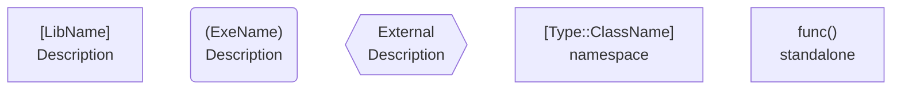
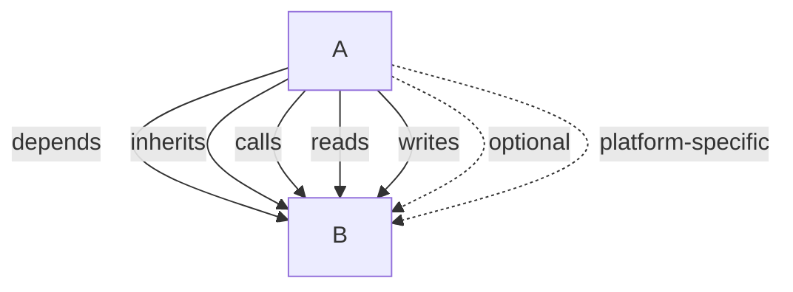
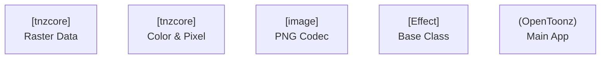
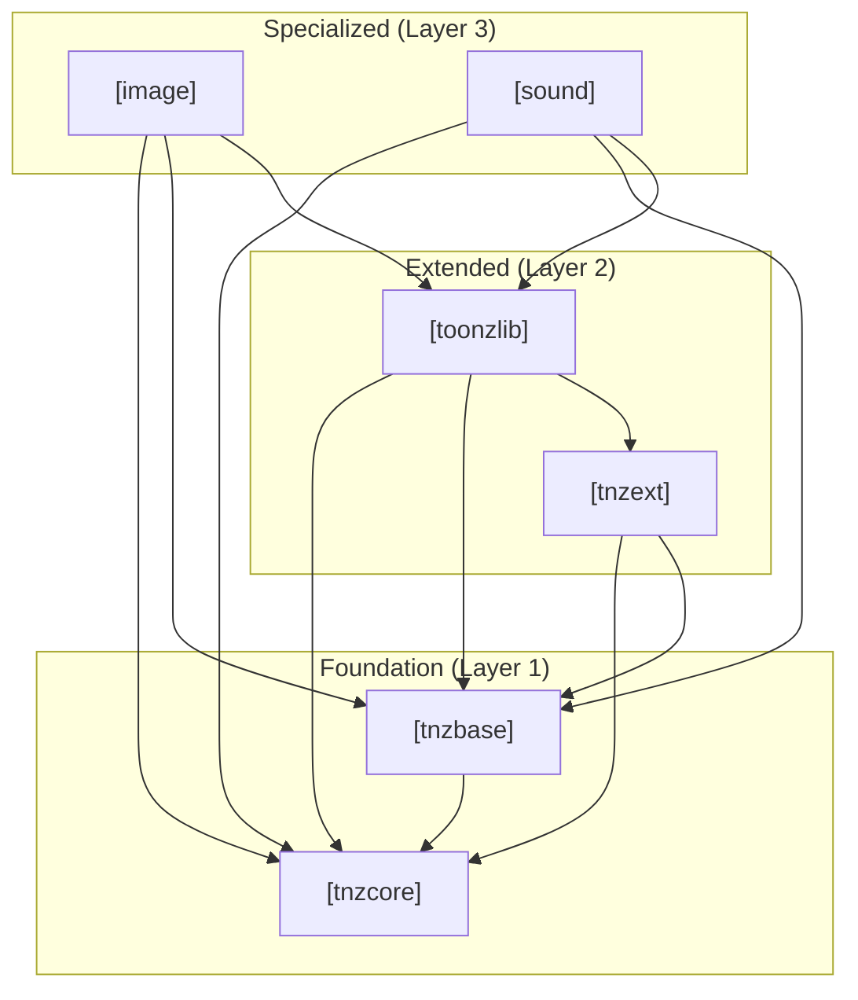
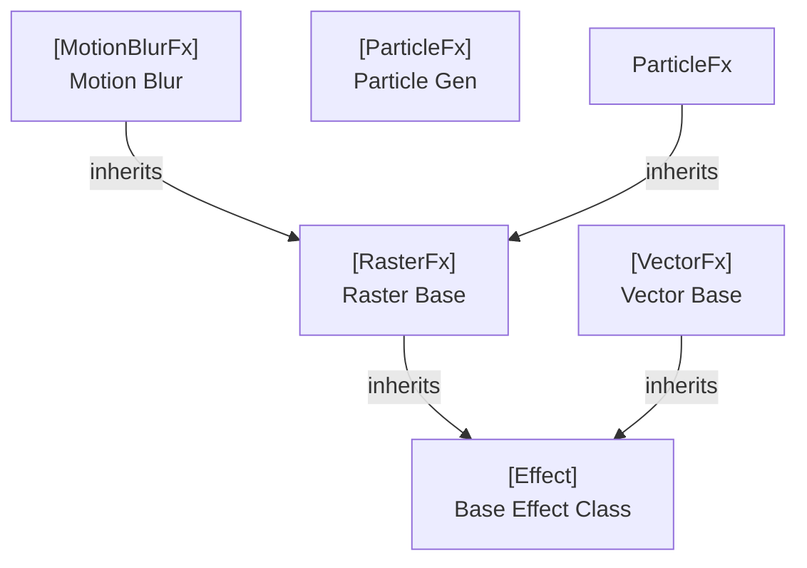
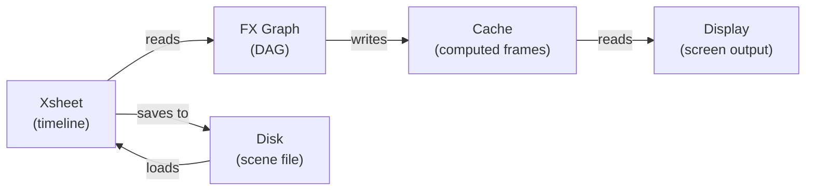
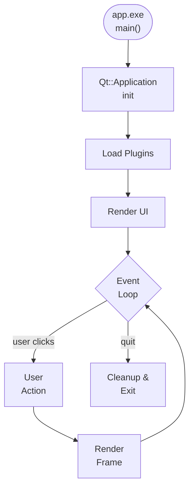
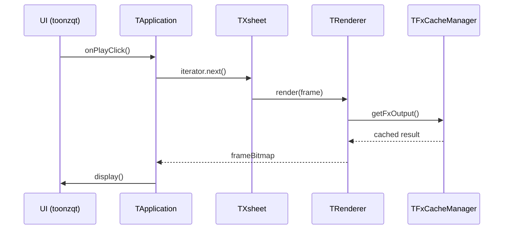
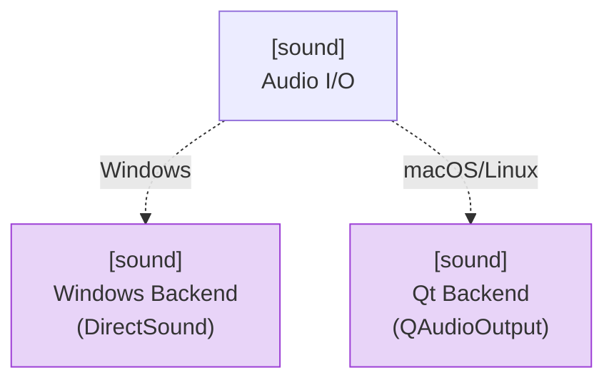

# OpenToonz Architectural Diagram Conventions & Complexity Budget

**Version:** 1.0  
**Date:** 2026-08-09  
**Scope:** All Mermaid diagrams in the opentoonz-codebase-visualization project  
**Authority:** Binding on phases: core-subsystem-analysis, class-hierarchy-diagrams, module-dependency-graph, execution-flow-diagrams

---

## 1. Diagram Complexity Budget

To maintain readability and cognitive load, all diagrams must adhere to strict entity and edge limits:

### Per-Document Constraint
- **Maximum diagrams per document**: 6
- **Rationale**: More than 6 diagrams in a single document dilutes focus. Split large subsystems across multiple documents by aspect or layer.

### Per-Diagram Limits

### Per-Diagram Size Categories

| Category | Max Entities | Max Edges | Max Nodes per Subgraph | Typical Use |
|----------|-------------|-----------|----------------------|-------------|
| **Tiny** | ≤6 | ≤5 | 3–4 | Single class, tight coupling demo |
| **Small** | 7–12 | 6–15 | 4–6 | Single subsystem, single concern |
| **Medium** | 13–20 | 16–25 | 7–10 | Multi-subsystem, one layer, OR class hierarchy of large subsystem |
| **Large** | 21–25 | 26–30 | 11–15 | Three interconnected subsystems, or full class tree |
| **XL (avoid)** | >25 | >30 | >15 | **SPLIT:** Break into two diagrams |

**Rule:** If a diagram would exceed "Large" limits (>25 nodes, >30 edges), split it immediately. Prefer two Medium diagrams over one oversized one.

### Splitting Strategy

When a diagram exceeds limits:

1. **By Layer:** Separate foundational classes from extended/specialized classes
   - Example: `tnzcore-foundation.md` (just core data types) + `tnzcore-rendering.md` (GL, rendering pipeline)

2. **By Subsystem:** Each major subsystem gets its own document
   - Example: `tnzlib-scene-management.md`, `tnzlib-xsheet.md`, `tnzlib-rendering.md`

3. **By Responsibility:** Group related classes/functions within a subsystem
   - Example: `tnzext-deformations.md`, `tnzext-linear-algebra.md`

4. **By Dependency Direction:** Inbound vs. outbound edges
   - Example: `image-consumers.md` (who uses image formats) vs. `image-formats.md` (format handlers internally)

### Compliance Check
At the start of each diagram:
```markdown
<!-- Complexity: 14 entities, 18 edges (within Medium budget ✓) -->
```

---

## 2. Mermaid Syntax & Node Types

### Node Types (Boxes)



| Syntax | Meaning | Color | Usage |
|--------|---------|-------|-------|
| `[name]` | Shared library (`.so`, `.dll`, `.dylib`) | Blue | Libraries in dependency graphs |
| `(name)` | Executable (`.exe`, command-line tool) | Red | Executables (OpenToonz, tfarmserver, etc.) |
| `{{name}}` | External/third-party (Qt, OpenGL, system) | Gray | Non-Toonz dependencies |
| `name` (plain) | Conceptual grouping (no box) | Black text | Logical subsystems in flow diagrams |

### Coloring Conventions

Use CSS `classDef` to color-code by layer:

```mermaid
classDef LayerCore fill:#1e3a8a,stroke:#1e40af,color:#fff
classDef LayerExt fill:#16a34a,stroke:#15803d,color:#fff
classDef LayerSpec fill:#ea580c,stroke:#c2410c,color:#fff
classDef LayerGUI fill:#8b5cf6,stroke:#7c3aed,color:#fff
classDef LayerExe fill:#dc2626,stroke:#b91c1c,color:#fff
classDef External fill:#6b7280,stroke:#4b5563,color:#fff

class tnzcore,tnzbase,tnzext LayerCore
class image,sound,colorfx LayerSpec
class toonzqt,tnztools LayerGUI
class OpenToonz,tfarmserver LayerExe
class Qt5,OpenGL External
```

**Layer Colors:**
- **Core (Blue):** tnzcore, tnzbase, tnzext — stable, foundation
- **Extended (Green):** image, sound, colorfx, tnzstdfx — specialized modules
- **Specialized (Orange):** Detailed subsystems within libraries (e.g., FX framework, scene graph)
- **GUI (Purple):** toonzqt, tnztools — UI/UX components
- **Executable (Red):** OpenToonz, tools, servers
- **External (Gray):** Qt, system libraries, third-party

### Edge Types (Arrows & Labels)



| Arrow | Label | Meaning | Usage |
|-------|-------|---------|-------|
| `→` | (solid) | Direct dependency | A requires B at link time |
| `→` with label | `depends`, `uses`, `links` | Dependency direction | Link-time dependency |
| `→` with label | `inherits`, `extends`, `implements` | Inheritance/interface | Class hierarchy |
| `→` with label | `calls`, `invokes` | Runtime call | Data/control flow |
| `→` with label | `reads`, `writes`, `modifies` | Data access | Memory access pattern |
| `⇢` (dashed) | `optional` | Conditional dependency | Only if feature enabled |
| `⇢` (dashed) | `platform-specific` | Platform variant | Windows/macOS/Linux specific |

**Edge Label Rules:**
- Keep labels short (1–2 words)
- Omit obvious labels like "depends" in dependency graphs
- Quantity labels for many connections: `depends (3 targets)`, `calls (5 methods)`

---

## 3. Document Structure

Every architectural diagram document must follow this structure:

```markdown
# [Subsystem] Architecture — [Aspect]

**Scope:** [what is shown]  
**Complexity:** [N entities, M edges (within X budget ✓/⚠️/❌)]  
**Layer:** [Core/Extended/Specialized/GUI/Executable]  
**Related Diagrams:** [links to related docs]  

## Overview
[1–2 sentence summary of what the diagram shows]

## Diagram
[Mermaid graph]

## Key Relationships
[Bullet points explaining major dependencies and flows]

## Design Notes
[Architecture decisions, why structured this way, gotchas, TODO items]

## References
- [Path to source file]
- [Path to CMakeLists.txt]
```

---

## 4. Naming Conventions

### Document Filenames

```
opentoonz__[subsystem]__[aspect].md
```

Examples:
- `opentoonz__tnzcore__foundation.md` – Core data types (pixels, colors, rasters)
- `opentoonz__tnzcore__rendering.md` – OpenGL, tessellation, offline GL
- `opentoonz__tnzlib__scene-management.md` – Project, stage, camera
- `opentoonz__image__format-handlers.md` – Image codec architecture
- `opentoonz__execution__startup.md` – Initialization sequence
- `opentoonz__execution__render-pipeline.md` – Effect evaluation → output

**Pattern:** `opentoonz__[layer]__[subsystem]__[aspect].md`

### Mermaid Node IDs



**Convention:** `id_[subsystem]_[concept]`
- Use snake_case for IDs
- Use PascalCase for C++ types within boxes
- Use [shortname] format for library names

---

## 5. Special Diagram Types

### 5.1 Dependency Graph (Library/Module Level)

**Purpose:** Show which libraries depend on which.

**Rules:**
- Nodes = libraries or executables
- Edges = "depends on" relationships
- Flow = downward (foundations at bottom, high-level at top)
- No class-level detail

**Example:**


### 5.2 Class Hierarchy (OOP Structure)

**Purpose:** Show inheritance trees, class relationships.

**Rules:**
- Nodes = classes or class families
- Edges = inheritance (`inherits`), composition (`has`), association
- Group by base class
- Limit depth to 2–3 levels unless subsystem is large

**Example:**


### 5.3 Data Flow Diagram (Runtime)

**Purpose:** Show how data moves during execution (file I/O, rendering, etc.).

**Rules:**
- Nodes = data structures or processing stages
- Edges = data flow direction (`reads`, `writes`, `transforms`)
- Include decision points (if/else)
- Show loops (iteration, frame-by-frame playback)

**Example:**


### 5.4 Control Flow Diagram (Execution Sequence)

**Purpose:** Show order of operations, branching, loops.

**Rules:**
- Nodes = functions, handlers, milestones
- Edges = call sequence or control transfer
- Use diamond for conditional branches
- Show entry/exit points clearly

**Example:**


---

## 6. Documentation Requirements for Each Diagram

### Mandatory Sections

1. **Title** – Clear, unique name
2. **Scope** – What is included/excluded
3. **Complexity Badge** – Entity/edge count vs. budget
4. **Layer** – Which layer(s) does this cover?
5. **Diagram** – Mermaid graph itself
6. **Key Relationships** – Bullet-pointed explanation of major flows/dependencies
7. **Design Notes** – Why this architecture? Gotchas? Future plans?

### Optional Sections

- **Related Diagrams** – Links to related architecture docs
- **Code References** – Specific file paths and line ranges
- **Performance Notes** – Bottlenecks, optimization opportunities
- **Testing Strategy** – Unit test organization, mock points

### Example Frontmatter

```markdown
# tnzcore Architecture — Raster & Color Processing

**Scope:** Pixel data types, color conversions, raster buffer management  
**Complexity:** 11 entities, 13 edges (within Small budget ✓)  
**Layer:** Core (Foundation)  
**Related:** opentoonz__tnzcore__rendering.md  

## Overview
tnzcore provides low-level raster data structures (TRaster, TPixel) 
and color utilities (TPixel32, TPixelGR8) used throughout OpenToonz.

## Diagram
[mermaid]

## Key Relationships
- TRaster is the main container for pixel data; immutable once created
- TPixel is the per-pixel value type; supports multiple formats (32-bit, 64-bit, grayscale)
- TImage is the high-level handle to TRaster; can contain multiple levels
```

---

## 7. Mermaid Configuration (Theme & Styling)

All diagrams use this standardized Mermaid header:

```mermaid
%%{init: {'flowchart': {'htmlLabels': true, 'curve': 'linear'}, 'theme': 'base', 'themeVariables': { 'primaryColor': '#f0f0f0', 'primaryTextColor': '#333', 'primaryBorderColor': '#333', 'lineColor': '#555', 'secondBkgColor': '#e3e3e3', 'tertiaryColor': '#fff', 'tertiaryTextColor': '#333', 'tertiaryBorderColor': '#333'}}}%%
graph TD
```

**Why?**
- `htmlLabels: true` – Allows formatted text (subscript, bold) in nodes
- `curve: 'linear'` – Straight edges, easier to read tight layouts
- Light theme – Suitable for documentation, dark mode render-friendly

---

## 8. Temporal/Sequential Diagrams

For execution flows showing time or sequence:



**Rules for Sequence Diagrams:**
- One per execution flow (startup, render, file load/save, etc.)
- Label all participant components
- Show both synchronous (→) and asynchronous (-->>) calls
- Keep sequence ≤15 steps to avoid scrolling

---

## 9. Visual Anchoring & Cross-References

### Linking Between Documents

```markdown
**See also:**
- [[opentoonz__tnzcore__rendering.md]] – OpenGL integration in tnzcore
- [[opentoonz__tnzlib__scene-management.md]] – High-level scene graph
```

Use `[[filename.md]]` format for internal wiki-style links.

### Intra-Diagram References

If a diagram gets too complex, add **TODO notes** for follow-up diagrams:

```markdown
## Design Notes

- **Composition vs. Inheritance:** TRaster uses composition for pixel format; 
  consider refactor to template-based hierarchy. See [[TODO-raster-refactor.md]].
- **TODO:** Extract Platform::Malloc allocation strategy into separate diagram
- **Performance:** TRaster copy-on-write semantics avoid deep copies; document in [[opentoonz__optimization__memory.md]]
```

---

## 10. Platform-Specific Notations

For multi-platform architectures, use dashed edges and notes:



**Rules:**
- Use dashed edges (`-.->`) for conditional/platform-specific dependencies
- Color platform-variant nodes differently (e.g., light purple)
- Label edge with platform name (Windows, macOS, Linux)

---

## 11. Checklist for Diagram Approval

Before finalizing any architectural diagram:

- [ ] **Complexity:** Entity/edge count ≤ budget limit (checked in doc header)
- [ ] **Accuracy:** All dependencies/relationships match current CMakeLists.txt
- [ ] **Naming:** Nodes use correct subsystem/class names
- [ ] **Mermaid Syntax:** Renders without errors; test in https://mermaid.live
- [ ] **Color Coding:** Consistent with layer colors (Core=blue, etc.)
- [ ] **Documentation:** Title, scope, key relationships, design notes present
- [ ] **Structure:** Follows prescribed template (overview, diagram, relationships, notes)
- [ ] **Cross-References:** Links to related diagrams; no orphaned docs
- [ ] **Splitting Validation:** If oversized, verify it was split correctly per strategy
- [ ] **Review:** Second reviewer confirms readability and accuracy

---

## 12. Migration Path for Existing Docs

Any legacy diagrams in the project should be:

1. **Assessed** – Check complexity; if >Large, split
2. **Reformatted** – Move to this naming scheme, add frontmatter
3. **Color-Coded** – Apply layer colors and classDef blocks
4. **Cross-Linked** – Add "Related Diagrams" sections
5. **Indexed** – Add to root DIAGRAMS.md index

---

## 13. Examples by Type

### Example 1: Dependency Graph (Small)

**File:** `opentoonz__layers__foundation.md`

```markdown
# Dependency Graph — Foundation Layer

**Scope:** Core libraries only (tnzcore, tnzbase, tnzext)  
**Complexity:** 3 entities, 2 edges (within Tiny budget ✓)  
**Layer:** Core (Foundation)

## Diagram
\`\`\`mermaid
graph TD
    tnzcore["[tnzcore]<br/>Pixels, Rasters, Geometry"]
    tnzbase["[tnzbase]<br/>FX System, Parameters"]
    tnzext["[tnzext]<br/>Deformations, Math"]
    
    tnzbase --> tnzcore
    tnzext --> tnzcore
    tnzext --> tnzbase
    
    classDef core fill:#1e3a8a,stroke:#1e40af,color:#fff
    class tnzcore,tnzbase,tnzext core
\`\`\`

## Key Relationships
- tnzbase provides the FX framework, which tnzext uses for effect registration
- Both tnzbase and tnzext depend on tnzcore for basic data types
\`\`\`

### Example 2: Class Hierarchy (Medium)

**File:** `opentoonz__tfx__effect-hierarchy.md`

```markdown
# FX Framework — Effect Class Hierarchy

**Scope:** Effect base classes and standard effect types  
**Complexity:** 8 entities, 7 edges (within Small budget ✓)  
**Layer:** Core (tnzbase)  

## Diagram
\`\`\`mermaid
graph TD
    Effect["[TFx]<br/>Base Effect Class"]
    RasterFx["[TRasterFx]<br/>Raster Effect"]
    ColumnFx["[TColumnFx]<br/>Column-Level Effect"]
    ZeraryFx["[TZeraryFx]<br/>No Inputs"]
    UnaryFx["[TUnaryFx]<br/>One Input"]
    BinaryFx["[TBinaryFx]<br/>Two Inputs"]
    
    RasterFx -->|inherits| Effect
    ColumnFx -->|inherits| Effect
    ZeraryFx -->|inherits| RasterFx
    UnaryFx -->|inherits| RasterFx
    BinaryFx -->|inherits| RasterFx
    
    classDef core fill:#1e3a8a,stroke:#1e40af,color:#fff
    class Effect,RasterFx,ColumnFx,ZeraryFx,UnaryFx,BinaryFx core
\`\`\`

## Key Relationships
- All effects inherit from TFx (abstract base)
- Standard effects inherit from TRasterFx (for image processing)
- Input arity determines subclass (0, 1, or 2 input ports)
\`\`\`

---

## 14. Future Enhancements

Potential improvements to this standard (not implemented yet):

- [ ] Mermaid 10+ features: class diagrams, state machines
- [ ] Interactive diagrams (clicking nodes expands detail)
- [ ] Automatically generated dependency graphs from CMake
- [ ] Metric overlays (coupling, cohesion, line-of-code count)
- [ ] Animation sequences showing data flow over time

---

## References

- **Mermaid Documentation:** https://mermaid.js.org/
- **Diagram Types:** https://mermaid.js.org/intro/
- **Open Toonz Dependency Map:** [[opentoonz__dependency_map.md]]
